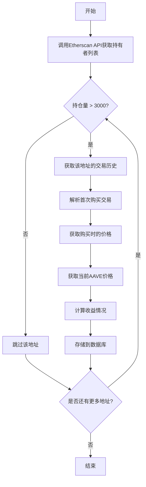

# AAVE代币持有者信息获取与收益分析

## 功能概述

获取持有超过3000个AAVE代币的钱包地址，追溯这些地址首次购买AAVE的时间和价格，并分析其当前持仓的获利情况。

## 业务目标

- 识别AAVE代币的大额持有者（持仓量 > 3000 AAVE）
- 分析这些持有者的购买成本和时间
- 计算当前持仓的收益情况
- 为投资决策提供数据支持

## 功能范围

### 核心功能

1. **持有者地址获取**：从以太坊区块链获取所有持有超过3000个AAVE的钱包地址
2. **购买信息追溯**：获取每个地址首次购买AAVE的时间和当时的价格
3. **收益分析计算**：基于购买成本和当前价格计算持仓收益
4. **数据持久化**：将分析结果存储到MySQL数据库
5. **API查询接口**：提供REST API供前端或其他系统查询分析结果

### 非功能需求

- 数据准确性：确保从可靠的数据源获取区块链数据
- 性能考虑：处理大量地址和交易记录时需要合理的批处理机制
- 错误处理：妥善处理API调用失败、数据缺失等异常情况
- 可扩展性：设计支持未来添加更多分析维度

## 技术方案

### 数据源选择

采用 **Etherscan API** 作为主要数据源：

- **理由**：Etherscan是以太坊区块链最权威的浏览器，提供完整的API服务，数据准确可靠
- **API类型**：RESTful API
- **认证方式**：需要申请API Key
- **关键接口**：
  - Token Holder查询接口：获取AAVE代币持有者列表
  - Transaction查询接口：获取地址的交易历史
  - Token价格接口：获取历史价格数据

### 系统架构

采用分层架构，在现有Spring Boot项目基础上扩展：

```
Controller层：提供REST API接口
    ↓
Service层：业务逻辑处理
    ↓
Repository层：数据持久化
    ↓
External API层：调用Etherscan API
```

### 数据流程



## 数据模型

### AAVE持有者信息表 (aave_holders)

| 字段名 | 数据类型 | 说明 | 约束 |
|--------|---------|------|------|
| id | BIGINT | 主键ID | 主键，自增 |
| wallet_address | VARCHAR(42) | 钱包地址 | 唯一索引，非空 |
| holding_amount | DECIMAL(30,18) | 当前持有AAVE数量 | 非空 |
| first_purchase_time | DATETIME | 首次购买时间 | 可为空 |
| first_purchase_price | DECIMAL(20,8) | 首次购买时的AAVE价格(USD) | 可为空 |
| first_purchase_amount | DECIMAL(30,18) | 首次购买数量 | 可为空 |
| current_price | DECIMAL(20,8) | 查询时的AAVE当前价格(USD) | 非空 |
| cost_basis | DECIMAL(30,8) | 购买成本(USD) | 可为空 |
| current_value | DECIMAL(30,8) | 当前持仓价值(USD) | 非空 |
| profit_loss | DECIMAL(30,8) | 收益金额(USD) | 可为空 |
| profit_loss_percentage | DECIMAL(10,2) | 收益率(%) | 可为空 |
| data_source | VARCHAR(50) | 数据来源 | 默认'Etherscan' |
| last_updated | DATETIME | 最后更新时间 | 非空 |
| created_at | DATETIME | 创建时间 | 非空 |

### 索引设计

- 主键索引：id
- 唯一索引：wallet_address
- 普通索引：holding_amount（用于按持仓量排序）
- 普通索引：profit_loss_percentage（用于按收益率排序）

## 核心业务逻辑

### 持有者筛选逻辑

1. 调用Etherscan API获取AAVE代币合约的所有持有者
2. 过滤条件：holding_amount > 3000
3. 排除合约地址，只保留EOA（外部账户）地址
4. 分页处理，避免一次性加载过多数据

### 购买信息追溯逻辑

1. 获取指定钱包地址的所有AAVE代币转入交易
2. 按时间正序排序，找到第一笔转入交易
3. 识别交易类型：
   - 从DEX购买（如Uniswap）：解析交易日志获取价格
   - 从CEX提币：无法直接获取价格，需查询当时的市场价格
   - 空投或转账：标记为非购买行为
4. 记录首次购买的时间戳、数量和价格

### 价格获取逻辑

**首次购买价格获取**：

1. 优先从DEX交易中解析实际成交价格
2. 如果无法解析，则调用历史价格API获取该时间点的市场价格
3. 使用CoinGecko或Etherscan的价格历史接口

**当前价格获取**：

1. 调用Etherscan或CoinGecko API获取AAVE的实时价格
2. 缓存价格数据，避免频繁调用API
3. 价格以美元(USD)为单位

### 收益计算逻辑

**成本计算**：
- cost_basis = first_purchase_price × first_purchase_amount

**当前价值**：
- current_value = current_price × holding_amount

**收益计算**：
- profit_loss = current_value - cost_basis
- profit_loss_percentage = (profit_loss / cost_basis) × 100

**特殊情况处理**：
- 如果无法获取首次购买价格，profit_loss和profit_loss_percentage设为NULL
- 如果持仓量发生变化，提示计算结果基于首次购买，实际收益可能不同

## API接口设计

### 触发数据同步接口

**端点**：POST /api/aave/holders/sync

**描述**：手动触发从Etherscan获取并分析AAVE持有者数据

**请求参数**：无

**响应示例**：

| 字段 | 类型 | 说明 |
|------|------|------|
| code | Integer | 响应码（200成功） |
| message | String | 响应消息 |
| data | Object | 同步结果统计 |
| data.totalProcessed | Integer | 处理的地址数量 |
| data.successCount | Integer | 成功分析的数量 |
| data.failedCount | Integer | 失败的数量 |

### 查询持有者列表接口

**端点**：GET /api/aave/holders

**描述**：查询AAVE持有者列表，支持排序和分页

**请求参数**：

| 参数名 | 类型 | 必填 | 说明 | 默认值 |
|--------|------|------|------|--------|
| page | Integer | 否 | 页码（从0开始） | 0 |
| size | Integer | 否 | 每页数量 | 20 |
| sortBy | String | 否 | 排序字段（holdingAmount, profitLossPercentage） | holdingAmount |
| order | String | 否 | 排序方向（asc, desc） | desc |
| minHolding | Decimal | 否 | 最小持仓量过滤 | 3000 |

**响应示例**：

| 字段 | 类型 | 说明 |
|------|------|------|
| code | Integer | 响应码 |
| message | String | 响应消息 |
| data | Object | 分页数据 |
| data.content | Array | 持有者列表 |
| data.totalElements | Long | 总记录数 |
| data.totalPages | Integer | 总页数 |
| data.currentPage | Integer | 当前页码 |

**持有者对象结构**：

| 字段 | 类型 | 说明 |
|------|------|------|
| walletAddress | String | 钱包地址 |
| holdingAmount | BigDecimal | 持有数量 |
| firstPurchaseTime | DateTime | 首次购买时间 |
| firstPurchasePrice | BigDecimal | 首次购买价格 |
| currentPrice | BigDecimal | 当前价格 |
| profitLoss | BigDecimal | 收益金额 |
| profitLossPercentage | BigDecimal | 收益率 |
| lastUpdated | DateTime | 更新时间 |

### 查询单个持有者详情接口

**端点**：GET /api/aave/holders/{address}

**描述**：查询指定钱包地址的详细信息

**路径参数**：

| 参数名 | 类型 | 必填 | 说明 |
|--------|------|------|------|
| address | String | 是 | 钱包地址 |

**响应示例**：与持有者对象结构相同

## 外部依赖

### Etherscan API

**基础信息**：
- API端点：https://api.etherscan.io/api
- 认证方式：API Key（通过查询参数传递）
- 速率限制：免费版 5次/秒

**关键接口映射**：

| 功能 | Etherscan模块 | Action | 说明 |
|------|--------------|--------|------|
| 获取代币持有者 | account | tokentx | 获取代币转账记录间接统计持有者 |
| 获取地址余额 | account | tokenbalance | 查询指定地址的代币余额 |
| 获取交易历史 | account | tokentx | 获取地址的代币交易记录 |

**AAVE代币信息**：
- 合约地址：0x7Fc66500c84A76Ad7e9c93437bFc5Ac33E2DDaE9
- 精度：18位小数
- 链：Ethereum Mainnet

### 价格数据API

**备选方案**：

1. **CoinGecko API**（推荐）
   - 免费额度充足
   - 支持历史价格查询
   - 端点：https://api.coingecko.com/api/v3

2. **Etherscan Price API**
   - 与主要数据源一致
   - 实时价格准确
   - 历史价格支持有限

## 配置管理

### 应用配置项

在 application.yml 中添加以下配置：

| 配置项 | 说明 | 示例值 |
|--------|------|--------|
| aave.etherscan.api-key | Etherscan API密钥 | YOUR_API_KEY |
| aave.etherscan.base-url | Etherscan API基础URL | https://api.etherscan.io/api |
| aave.token.contract-address | AAVE代币合约地址 | 0x7Fc66500c84A76Ad7e9c93437bFc5Ac33E2DDaE9 |
| aave.token.min-holding | 最小持仓量阈值 | 3000 |
| aave.coingecko.api-url | CoinGecko API地址 | https://api.coingecko.com/api/v3 |
| aave.coingecko.token-id | AAVE在CoinGecko的ID | aave |
| aave.sync.batch-size | 批处理大小 | 100 |
| aave.cache.price-ttl | 价格缓存时间(秒) | 300 |

### 环境配置

需要在不同环境配置文件中设置：
- application-dev.yml：开发环境使用测试API Key
- application-prod.yml：生产环境使用正式API Key

## 错误处理策略

### API调用失败处理

| 错误类型 | 处理策略 |
|---------|---------|
| API速率限制 | 等待并重试，最多重试3次 |
| API密钥无效 | 记录错误日志，抛出配置异常 |
| 网络超时 | 重试机制，超时时间30秒 |
| 响应数据格式错误 | 记录详细日志，跳过该条数据 |
| 合约地址不存在 | 验证配置，抛出业务异常 |

### 数据处理异常

| 异常场景 | 处理方式 |
|---------|---------|
| 无法解析交易数据 | 记录地址和原因，继续处理下一个 |
| 价格数据缺失 | 将相关字段设为NULL，标记数据不完整 |
| 数据库写入失败 | 回滚事务，记录错误日志 |
| 大量地址处理超时 | 分批处理，支持断点续传 |

### 日志记录要求

- INFO级别：记录同步开始、完成、统计信息
- WARN级别：记录API限流、部分数据缺失
- ERROR级别：记录API调用失败、数据库异常、配置错误

## 性能优化考虑

### 批处理策略

- 每批处理100个地址
- 每批之间间隔1秒，避免API限流
- 支持并发处理多个API调用（控制在5个并发内）

### 缓存机制

**当前价格缓存**：
- 缓存时间：5分钟
- 缓存范围：应用级内存缓存
- 减少对价格API的频繁调用

**持有者列表缓存**：
- 缓存时间：1小时
- 缓存键：包含排序和过滤参数
- 适用于查询频繁的场景

### 数据库优化

- 批量插入：使用JPA的batch insert
- 索引优化：在常用查询字段上建立索引
- 分页查询：避免一次性加载大量数据

## 安全考虑

### API密钥保护

- 不在代码中硬编码API Key
- 使用环境变量或配置中心管理敏感信息
- 生产环境API Key权限最小化

### 数据验证

- 验证钱包地址格式（以0x开头的42位十六进制字符）
- 验证数值范围合理性
- 防止SQL注入（使用参数化查询）

### 访问控制

- API接口添加身份认证（后续可扩展）
- 同步接口限制访问频率，防止滥用
- 敏感操作记录审计日志

## 扩展性设计

### 未来可扩展功能

1. **多代币支持**：将AAVE特定逻辑抽象为通用代币分析框架
2. **定时任务**：添加定时自动同步功能
3. **更详细的交易分析**：记录所有购买记录而非仅首次购买
4. **收益趋势分析**：记录历史快照，分析收益变化趋势
5. **通知功能**：持仓或收益达到阈值时发送通知
6. **数据导出**：支持将分析结果导出为CSV或Excel

### 架构扩展点

- Service层接口化，方便替换不同的区块链数据源
- 价格获取策略化，支持多种价格API切换
- 收益计算逻辑可配置化，支持不同的计算方法

## 实施步骤

1. **环境准备**
   - 申请Etherscan API Key
   - 配置项目依赖（HTTP客户端库）
   
2. **数据层开发**
   - 创建数据库表结构
   - 实现Repository接口

3. **外部API集成**
   - 封装Etherscan API调用
   - 封装价格API调用
   - 实现重试和错误处理机制

4. **业务逻辑实现**
   - 实现持有者数据获取逻辑
   - 实现购买信息追溯逻辑
   - 实现收益计算逻辑

5. **接口层开发**
   - 实现同步接口
   - 实现查询接口
   - 统一响应格式

6. **测试验证**
   - 单元测试
   - 集成测试
   - 使用少量真实数据验证

7. **部署上线**
   - 配置生产环境参数
   - 执行数据库迁移
   - 首次全量数据同步

## 限制与假设

### 技术限制

- Etherscan免费API有速率限制，大量数据同步需要较长时间
- 无法100%准确追溯所有地址的购买成本（场外交易、私下转账等场景）
- 历史价格数据的准确性依赖第三方API

### 业务假设

- 假设首次转入即为购买行为（实际可能是转账或其他操作）
- 收益计算基于首次购买成本，不考虑后续加仓或减仓
- 持仓量以查询时的快照为准，不实时更新
- 以美元作为统一计价单位

### 数据范围

- 仅分析以太坊主网上的AAVE代币
- 不包括其他链上的AAVE（如Polygon、Arbitrum等）
- 不分析stAAVE或其他衍生代币

## 风险评估

| 风险项 | 影响 | 可能性 | 缓解措施 |
|--------|------|--------|---------|
| API服务不可用 | 高 | 低 | 实现重试机制，准备备用API |
| API费用超预算 | 中 | 中 | 监控API调用量，设置预警阈值 |
| 数据准确性问题 | 高 | 中 | 多数据源交叉验证，标注数据可信度 |
| 性能瓶颈 | 中 | 中 | 分批处理，缓存优化 |
| 区块链数据变化 | 低 | 高 | 定期重新同步，更新机制 |
