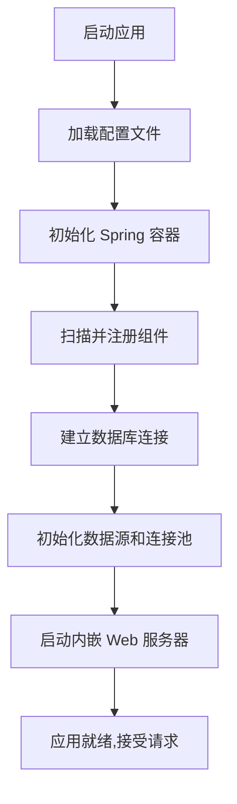
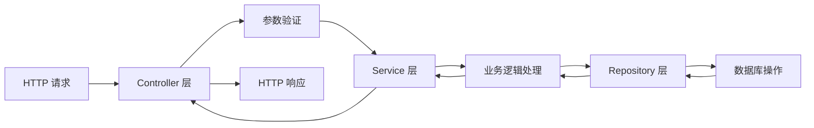
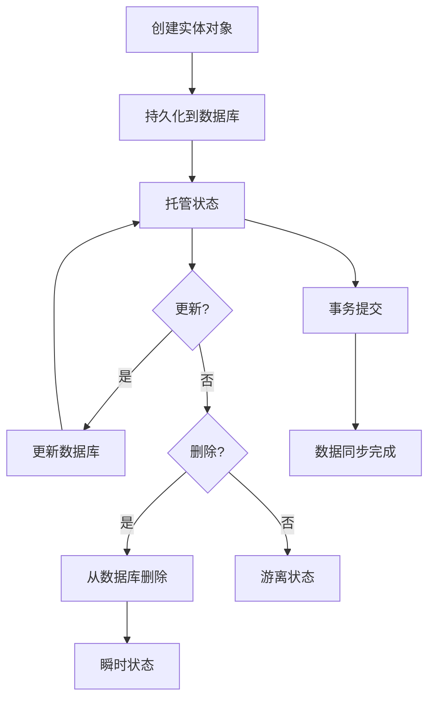

# Spring Boot Maven 项目设计文档

## 项目概述

本设计旨在创建一个基于 Spring Boot 的 Maven 项目,提供 Web 服务能力和数据库连接支持,为后续业务功能开发奠定基础。

## 设计目标

- 建立标准的 Spring Boot 项目结构
- 集成 Web 层支持,提供 RESTful API 能力
- 集成数据库访问层,支持数据持久化
- 提供可扩展的配置管理机制

## 技术选型

### 核心框架
- **Spring Boot**: 2.7.x 或 3.x 版本,提供快速开发和自动配置能力
- **Maven**: 项目构建和依赖管理工具

### Web 层
- **Spring Web (spring-boot-starter-web)**: 提供 RESTful API 开发能力
- 内嵌 Tomcat 服务器

### 数据访问层
- **Spring Data JPA (spring-boot-starter-data-jpa)**: 提供 ORM 框架支持
- **数据库驱动**: 
  - MySQL 驱动 (mysql-connector-java)
  - 或其他数据库驱动(PostgreSQL/H2 等)

### 开发辅助
- **Lombok**: 简化实体类开发
- **Spring Boot DevTools**: 提供热部署能力

## 项目结构设计

```
项目根目录
├── src/main/java
│   └── [包名结构]
│       ├── controller      # Web 控制器层
│       ├── service         # 业务逻辑层
│       ├── repository      # 数据访问层
│       ├── entity          # 数据实体层
│       ├── dto             # 数据传输对象
│       ├── config          # 配置类
│       └── Application.java # 应用启动类
├── src/main/resources
│   ├── application.yml     # 应用配置文件
│   └── static              # 静态资源目录
│   └── templates           # 模板目录
└── src/test/java           # 测试代码目录
```

## 核心组件设计

### 应用启动类

**职责**: 作为 Spring Boot 应用的入口点

**关键要素**:
- 使用 @SpringBootApplication 注解
- 包含 main 方法启动应用
- 位于根包下,确保组件扫描覆盖所有子包

### Web 层设计

**Controller 层**:
- 负责接收 HTTP 请求并返回响应
- 使用 @RestController 注解标识
- 遵循 RESTful API 设计规范
- 处理请求参数验证和异常处理

**响应结构**:
- 统一的响应格式(状态码、消息、数据)
- 支持分页查询结果封装

### 业务逻辑层

**Service 层**:
- 使用 @Service 注解标识
- 包含核心业务逻辑
- 处理事务管理
- 协调多个 Repository 完成复杂业务操作

### 数据访问层

**Repository 层**:
- 继承 JpaRepository 接口
- 提供基础 CRUD 操作
- 支持自定义查询方法
- 使用方法命名约定或 @Query 注解

**Entity 层**:
- 使用 @Entity 注解标识数据库实体
- 使用 @Table 指定表名
- 使用 @Id 和 @GeneratedValue 定义主键策略
- 使用 @Column 定义字段映射关系

## 数据库连接配置设计

### 连接参数

| 配置项 | 说明 | 示例值 |
|--------|------|--------|
| 数据库 URL | 数据库连接地址 | jdbc:mysql://localhost:3306/database_name |
| 用户名 | 数据库访问用户 | root |
| 密码 | 数据库访问密码 | [加密存储] |
| 驱动类名 | JDBC 驱动类 | com.mysql.cj.jdbc.Driver |

### 连接池配置

| 配置项 | 说明 | 建议值 |
|--------|------|--------|
| 最大连接数 | 连接池最大连接数 | 10 |
| 最小空闲连接数 | 连接池最小空闲连接数 | 5 |
| 连接超时时间 | 获取连接的超时时间 | 30000ms |
| 空闲超时时间 | 连接空闲超时时间 | 600000ms |

### JPA 配置

| 配置项 | 说明 | 建议值 |
|--------|------|--------|
| DDL 自动生成策略 | 表结构自动管理方式 | update (开发) / validate (生产) |
| SQL 显示 | 是否在日志中显示 SQL | true (开发) / false (生产) |
| SQL 格式化 | 是否格式化 SQL 输出 | true |
| 数据库方言 | 数据库特定方言 | 根据数据库类型自动检测 |

## Maven 依赖配置

### 核心依赖项

| 依赖 | Group ID | Artifact ID | 说明 |
|------|----------|-------------|------|
| Spring Boot 父依赖 | org.springframework.boot | spring-boot-starter-parent | 版本管理 |
| Web Starter | org.springframework.boot | spring-boot-starter-web | Web 支持 |
| JPA Starter | org.springframework.boot | spring-boot-starter-data-jpa | JPA 支持 |
| 数据库驱动 | mysql | mysql-connector-java | MySQL 驱动 |
| Lombok | org.projectlombok | lombok | 开发辅助 |

### 测试依赖

| 依赖 | Group ID | Artifact ID | 说明 |
|------|----------|-------------|------|
| 测试 Starter | org.springframework.boot | spring-boot-starter-test | 测试框架 |

## 配置管理设计

### 配置文件结构

采用 YAML 格式的配置文件,按功能模块组织:

- **服务器配置**: 端口、上下文路径等
- **数据源配置**: 数据库连接信息
- **JPA 配置**: Hibernate 相关配置
- **日志配置**: 日志级别和输出格式

### 多环境配置

支持多环境配置文件管理:
- application.yml (通用配置)
- application-dev.yml (开发环境)
- application-test.yml (测试环境)
- application-prod.yml (生产环境)

通过激活不同的 profile 切换环境配置

## 应用启动流程



## 典型请求处理流程



## 数据库实体生命周期



## 异常处理策略

### 全局异常处理

- 使用 @ControllerAdvice 实现统一异常拦截
- 区分业务异常和系统异常
- 返回标准化的错误响应格式

### 异常分类

| 异常类型 | 处理方式 | HTTP 状态码 |
|----------|----------|-------------|
| 参数验证异常 | 返回详细验证错误信息 | 400 |
| 业务逻辑异常 | 返回业务错误提示 | 200/400 |
| 数据访问异常 | 记录日志,返回通用错误 | 500 |
| 系统异常 | 记录日志,返回通用错误 | 500 |

## 日志设计

### 日志级别

- **ERROR**: 系统错误和异常
- **WARN**: 警告信息
- **INFO**: 关键业务流程
- **DEBUG**: 详细调试信息

### 日志内容

- 请求入口和出口日志
- 关键业务操作日志
- 异常堆栈信息
- 数据库操作 SQL(开发环境)

## 安全性考虑

### 数据库安全

- 配置文件中的敏感信息加密
- 使用连接池管理连接
- 参数化查询防止 SQL 注入

### 应用安全

- 输入参数验证
- 异常信息脱敏
- 限制数据库连接数防止资源耗尽

## 性能优化策略

### 数据库层面

- 合理配置连接池参数
- 启用查询缓存
- 优化查询语句和索引

### 应用层面

- 使用分页查询大数据集
- 合理使用懒加载和急加载
- 异步处理非关键业务

## 扩展性设计

### 模块化

- 按业务领域划分包结构
- 各层职责清晰,便于独立扩展

### 配置外部化

- 支持外部配置文件覆盖
- 支持环境变量配置
- 便于容器化部署

### 数据库切换

- 通过修改配置和驱动依赖即可切换数据库
- JPA 屏蔽数据库差异

## 部署运行

### 打包方式

- 生成可执行 JAR 文件
- 包含所有依赖和内嵌服务器

### 启动方式

- 直接运行 JAR 文件启动应用
- 支持通过参数指定配置文件路径
- 支持通过环境变量覆盖配置

### 健康检查

- 提供健康检查端点
- 监控数据库连接状态
- 监控应用运行状态

## 验收标准

1. **项目结构**: 项目目录结构符合 Maven 标准和分层架构设计
2. **依赖管理**: 所有必要依赖已正确配置
3. **应用启动**: 应用能够成功启动,无报错
4. **数据库连接**: 能够成功连接到数据库
5. **Web 服务**: Web 服务能够正常响应 HTTP 请求
6. **基础功能**: 能够完成基本的 CRUD 操作
7. **配置生效**: 配置文件中的配置能够正确加载并生效
