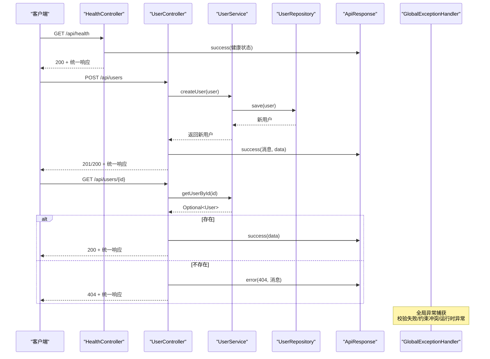
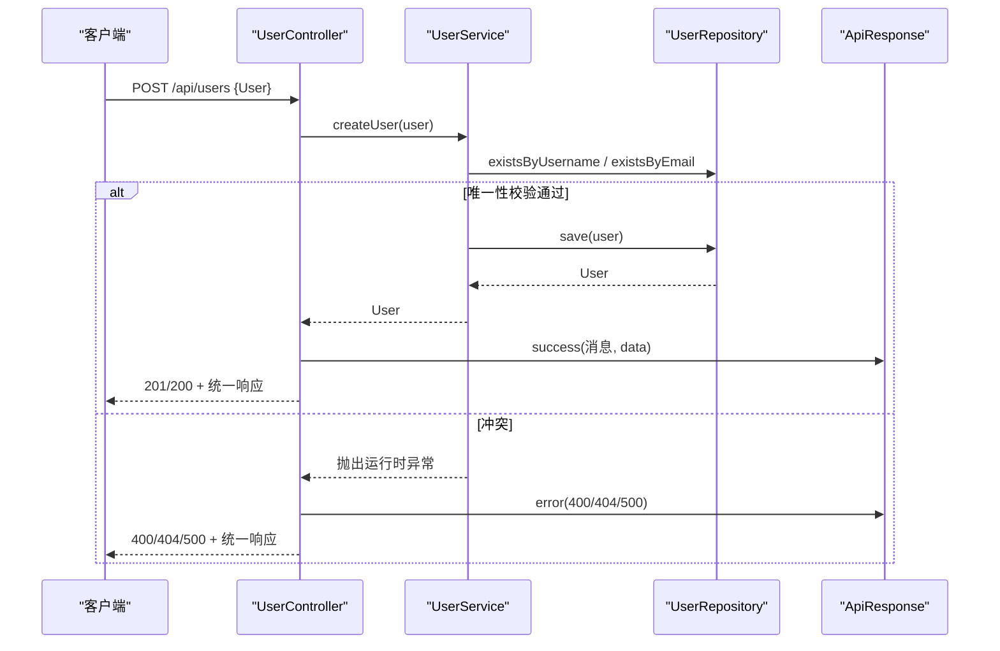
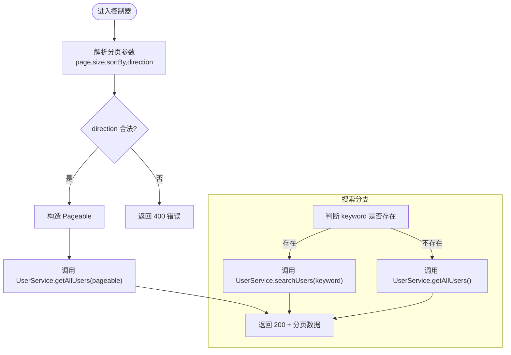
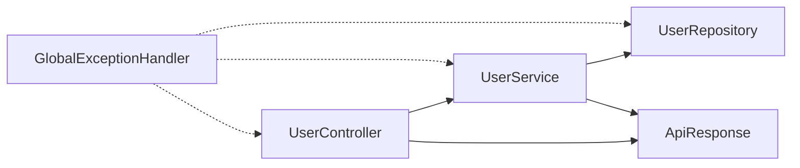

# API端点参考

<cite>
**本文引用的文件**
- [Application.java](file://src/main/java/com/defi/aave/Application.java)
- [HealthController.java](file://src/main/java/com/defi/aave/controller/HealthController.java)
- [UserController.java](file://src/main/java/com/defi/aave/controller/UserController.java)
- [ApiResponse.java](file://src/main/java/com/defi/aave/dto/ApiResponse.java)
- [User.java](file://src/main/java/com/defi/aave/entity/User.java)
- [UserService.java](file://src/main/java/com/defi/aave/service/UserService.java)
- [UserRepository.java](file://src/main/java/com/defi/aave/repository/UserRepository.java)
- [GlobalExceptionHandler.java](file://src/main/java/com/defi/aave/exception/GlobalExceptionHandler.java)
- [pom.xml](file://pom.xml)
- [application.yml](file://src/main/resources/application.yml)
- [README.md](file://README.md)
</cite>

## 目录
1. [简介](#简介)
2. [项目结构](#项目结构)
3. [核心组件](#核心组件)
4. [架构总览](#架构总览)
5. [详细组件分析](#详细组件分析)
6. [依赖关系分析](#依赖关系分析)
7. [性能与扩展性考虑](#性能与扩展性考虑)
8. [故障排查指南](#故障排查指南)
9. [结论](#结论)
10. [附录：API清单与示例](#附录api清单与示例)

## 简介
本文件为 defi_aave 项目的公开API端点参考，覆盖 UserController 和 HealthController 中的全部RESTful接口。内容包括：
- 每个端点的HTTP方法、URL路径、请求参数、请求体结构、响应格式与错误码
- ApiResponse 统一响应封装的设计模式及其价值
- 用户管理接口的调用流程、数据校验规则、分页与搜索实现细节
- 健康检查接口在系统监控与运维中的应用场景
- curl 命令示例与 JSON 请求/响应样例
- 认证机制、速率限制、API版本控制策略与安全注意事项

## 项目结构
项目采用典型的分层架构（控制器、服务、数据访问、实体、DTO），并使用 Spring Boot 提供的 Web、JPA、Actuator 等能力。应用默认运行于 8080 端口，上下文路径为 /api；健康检查端点位于 /health。

```mermaid
graph TB
A["Application<br/>应用入口"] --> B["HealthController<br/>健康检查"]
A --> C["UserController<br/>用户管理"]
C --> D["UserService<br/>业务逻辑"]
D --> E["UserRepository<br/>数据访问"]
E --> F["User<br/>实体模型"]
G["ApiResponse<br/>统一响应封装"] <- --> C
G <- --> B
H["GlobalExceptionHandler<br/>全局异常处理"] -.-> C
H -.-> B
```

图表来源
- [Application.java](file://src/main/java/com/defi/aave/Application.java#L1-L20)
- [HealthController.java](file://src/main/java/com/defi/aave/controller/HealthController.java#L1-L47)
- [UserController.java](file://src/main/java/com/defi/aave/controller/UserController.java#L1-L190)
- [UserService.java](file://src/main/java/com/defi/aave/service/UserService.java#L1-L158)
- [UserRepository.java](file://src/main/java/com/defi/aave/repository/UserRepository.java#L1-L55)
- [User.java](file://src/main/java/com/defi/aave/entity/User.java#L1-L54)
- [ApiResponse.java](file://src/main/java/com/defi/aave/dto/ApiResponse.java#L1-L77)
- [GlobalExceptionHandler.java](file://src/main/java/com/defi/aave/exception/GlobalExceptionHandler.java#L1-L98)

章节来源
- [README.md](file://README.md#L91-L145)
- [application.yml](file://src/main/resources/application.yml#L4-L8)

## 核心组件
- 统一响应封装 ApiResponse：所有接口返回固定结构 code、message、data，便于前端统一处理与调试。
- 控制器层：HealthController 提供健康检查与欢迎信息；UserController 提供用户全量管理能力。
- 服务层：UserService 负责业务规则与事务控制，包含用户名/邮箱唯一性校验、按条件查询、分页与搜索等。
- 数据访问层：UserRepository 基于 Spring Data JPA，提供自定义查询与唯一性检查。
- 全局异常处理：GlobalExceptionHandler 将校验失败、约束冲突、运行时异常等转换为统一错误响应。

章节来源
- [ApiResponse.java](file://src/main/java/com/defi/aave/dto/ApiResponse.java#L1-L77)
- [HealthController.java](file://src/main/java/com/defi/aave/controller/HealthController.java#L1-L47)
- [UserController.java](file://src/main/java/com/defi/aave/controller/UserController.java#L1-L190)
- [UserService.java](file://src/main/java/com/defi/aave/service/UserService.java#L1-L158)
- [UserRepository.java](file://src/main/java/com/defi/aave/repository/UserRepository.java#L1-L55)
- [GlobalExceptionHandler.java](file://src/main/java/com/defi/aave/exception/GlobalExceptionHandler.java#L1-L98)

## 架构总览
下图展示从客户端到控制器、服务与数据访问层的调用链路，以及统一响应封装与异常处理的集成方式。



图表来源
- [HealthController.java](file://src/main/java/com/defi/aave/controller/HealthController.java#L1-L47)
- [UserController.java](file://src/main/java/com/defi/aave/controller/UserController.java#L1-L190)
- [UserService.java](file://src/main/java/com/defi/aave/service/UserService.java#L1-L158)
- [UserRepository.java](file://src/main/java/com/defi/aave/repository/UserRepository.java#L1-L55)
- [ApiResponse.java](file://src/main/java/com/defi/aave/dto/ApiResponse.java#L1-L77)
- [GlobalExceptionHandler.java](file://src/main/java/com/defi/aave/exception/GlobalExceptionHandler.java#L1-L98)

## 详细组件分析

### 统一响应封装 ApiResponse
- 设计目标：前后端一致的响应结构，降低前端适配成本，提升可观测性与可维护性。
- 结构字段：
  - code：HTTP语义码（200/400/500），用于快速识别成功/客户端错误/服务端错误
  - message：人类可读的消息
  - data：实际数据，可为空（如删除成功）
- 工厂方法：
  - success(data)、success(message, data)、success()：成功场景
  - error(message)、error(code, message)：服务端错误
  - badRequest(message)：客户端错误（如校验失败）

价值与收益：
- 前端无需区分不同控制器的响应差异，统一解析 code/message/data 即可
- 便于接入网关、监控与告警系统
- 与全局异常处理配合，保证错误信息标准化

章节来源
- [ApiResponse.java](file://src/main/java/com/defi/aave/dto/ApiResponse.java#L1-L77)

### 健康检查接口（HealthController）
- 端点列表
  - GET /api/health：返回应用健康状态、时间戳、版本等
  - GET /api/health/welcome：返回欢迎信息
- 响应结构：统一 ApiResponse，data 为对象或字符串
- 应用场景：容器编排健康探针、运维监控面板、自动化巡检

章节来源
- [HealthController.java](file://src/main/java/com/defi/aave/controller/HealthController.java#L1-L47)
- [README.md](file://README.md#L128-L134)

### 用户管理接口（UserController）
- 基础路径：/api/users
- 支持的HTTP方法与路径：
  - POST /api/users：创建用户
  - GET /api/users：获取所有用户（支持关键词搜索）
  - GET /api/users/{id}：按ID获取用户
  - GET /api/users/active：获取活跃用户
  - GET /api/users/page：分页获取用户（page、size、sortBy、direction）
  - GET /api/users/count：获取用户总数
  - PUT /api/users/{id}：更新用户
  - DELETE /api/users/{id}：删除用户

- 请求参数与请求体
  - 创建/更新用户：请求体为 User 对象（见实体字段说明）
  - 搜索：GET /api/users?keyword={关键字}
  - 分页：GET /api/users/page?page=&size=&sortBy=&direction=（direction 支持 ASC/DESC）
  - 其他：无额外请求参数

- 响应格式
  - 成功：ApiResponse.success(...)，data 为具体资源或分页结果
  - 失败：ApiResponse.error(...) 或 ApiResponse.badRequest(...)，code 为 400/500

- 错误码与典型场景
  - 400：请求体校验失败、约束冲突、非法参数
  - 404：用户不存在（更新/删除/按ID查询）
  - 500：服务内部异常（数据库异常、未捕获异常）

- 数据验证与业务规则
  - 创建用户：用户名与邮箱唯一性检查，违反则抛出运行时异常
  - 更新用户：仅对非空字段进行部分更新
  - 搜索：按用户名或邮箱模糊匹配
  - 分页：排序方向使用 Sort.Direction.fromString(direction)，非法值将导致异常

- 调用序列（以创建用户为例）



图表来源
- [UserController.java](file://src/main/java/com/defi/aave/controller/UserController.java#L1-L190)
- [UserService.java](file://src/main/java/com/defi/aave/service/UserService.java#L1-L158)
- [UserRepository.java](file://src/main/java/com/defi/aave/repository/UserRepository.java#L1-L55)
- [ApiResponse.java](file://src/main/java/com/defi/aave/dto/ApiResponse.java#L1-L77)

- 关键流程图（分页与搜索）



图表来源
- [UserController.java](file://src/main/java/com/defi/aave/controller/UserController.java#L66-L108)
- [UserService.java](file://src/main/java/com/defi/aave/service/UserService.java#L72-L102)

章节来源
- [UserController.java](file://src/main/java/com/defi/aave/controller/UserController.java#L1-L190)
- [UserService.java](file://src/main/java/com/defi/aave/service/UserService.java#L1-L158)
- [UserRepository.java](file://src/main/java/com/defi/aave/repository/UserRepository.java#L1-L55)
- [User.java](file://src/main/java/com/defi/aave/entity/User.java#L1-L54)

## 依赖关系分析
- 控制器依赖服务层，服务层依赖数据访问层，形成清晰的分层依赖
- ApiResponse 作为跨层契约，被控制器与异常处理共同使用
- 全局异常处理器统一拦截校验与运行时异常，保证错误响应一致性



图表来源
- [UserController.java](file://src/main/java/com/defi/aave/controller/UserController.java#L1-L190)
- [UserService.java](file://src/main/java/com/defi/aave/service/UserService.java#L1-L158)
- [UserRepository.java](file://src/main/java/com/defi/aave/repository/UserRepository.java#L1-L55)
- [ApiResponse.java](file://src/main/java/com/defi/aave/dto/ApiResponse.java#L1-L77)
- [GlobalExceptionHandler.java](file://src/main/java/com/defi/aave/exception/GlobalExceptionHandler.java#L1-L98)

章节来源
- [pom.xml](file://pom.xml#L31-L93)
- [application.yml](file://src/main/resources/application.yml#L4-L8)

## 性能与扩展性考虑
- 分页与排序：使用 PageRequest + Sort，建议在高频查询场景下对常用过滤字段建立索引
- 搜索：LIKE 查询在大数据量下可能成为瓶颈，建议引入全文检索或更高效的匹配策略
- 缓存：对热点用户查询（如按ID、用户名、邮箱）可引入缓存层减少数据库压力
- 并发与事务：创建/更新涉及唯一性检查与保存，注意锁竞争与回滚开销
- 监控与指标：结合 Actuator 暴露的 /actuator/metrics，采集关键指标（QPS、延迟、错误率）

[本节为通用指导，不直接分析具体文件]

## 故障排查指南
- 常见错误类型与定位
  - 参数校验失败：MethodArgumentNotValidException，返回 400，message 中包含字段级错误
  - 约束冲突：ConstraintViolationException，返回 400，message 中包含约束信息
  - 运行时异常：RuntimeException，返回 500，message 为异常消息
  - 未捕获异常：Exception，返回 500，message 为通用提示
- 排查步骤
  - 查看日志：确认控制器与服务层的日志级别配置
  - 校验请求体：确保字段类型与长度符合实体定义
  - 检查唯一性：用户名/邮箱/钱包地址唯一性冲突会导致创建失败
  - 分页参数：direction 必须为 ASC/DESC，否则触发异常

章节来源
- [GlobalExceptionHandler.java](file://src/main/java/com/defi/aave/exception/GlobalExceptionHandler.java#L1-L98)
- [application.yml](file://src/main/resources/application.yml#L43-L53)

## 结论
本项目通过清晰的分层架构与统一响应封装，提供了稳定、易用且可扩展的REST API。用户管理接口覆盖了常见CRUD与高级特性（分页、搜索、活跃用户筛选），健康检查接口满足运维监控需求。建议在生产环境中进一步完善认证授权、限流降级、缓存与索引优化，并结合 Actuator 与日志体系持续改进系统可观测性。

[本节为总结性内容，不直接分析具体文件]

## 附录：API清单与示例

### 健康检查
- GET /api/health
  - 响应：ApiResponse，data 为包含 status、timestamp、application、version 的对象
  - 示例响应：见 README 的“健康检查”示例
- GET /api/health/welcome
  - 响应：ApiResponse，data 为字符串

章节来源
- [HealthController.java](file://src/main/java/com/defi/aave/controller/HealthController.java#L1-L47)
- [README.md](file://README.md#L160-L178)

### 用户管理
- POST /api/users
  - 请求体：User 对象（见实体字段说明）
  - 成功：201/200，data 为新建用户
  - 失败：400/404/500，message 为错误信息
  - 示例请求/响应：见 README 的“创建用户”示例
- GET /api/users
  - 查询参数：keyword（可选），按用户名或邮箱模糊匹配
  - 成功：200，data 为用户列表
  - 失败：500，message 为错误信息
- GET /api/users/{id}
  - 成功：200，data 为用户
  - 失败：404，message 为“用户不存在”
- GET /api/users/active
  - 成功：200，data 为活跃用户列表
  - 失败：500，message 为错误信息
- GET /api/users/page
  - 查询参数：page（默认0）、size（默认10）、sortBy（默认id）、direction（默认ASC，支持ASC/DESC）
  - 成功：200，data 为分页对象（含内容、页码、大小、总数等）
  - 失败：500，message 为错误信息
- GET /api/users/count
  - 成功：200，data 为用户总数
  - 失败：500，message 为错误信息
- PUT /api/users/{id}
  - 请求体：User 对象（仅非空字段会被更新）
  - 成功：200，data 为更新后的用户
  - 失败：404/500，message 为错误信息
- DELETE /api/users/{id}
  - 成功：200，data 为空
  - 失败：404/500，message 为错误信息

章节来源
- [UserController.java](file://src/main/java/com/defi/aave/controller/UserController.java#L1-L190)
- [README.md](file://README.md#L128-L145)

### 统一响应格式
- 所有接口统一返回结构：
  - code：200/400/500
  - message：字符串
  - data：任意类型或 null
- 示例：见 README 的“API 响应格式”与各端点示例

章节来源
- [ApiResponse.java](file://src/main/java/com/defi/aave/dto/ApiResponse.java#L1-L77)
- [README.md](file://README.md#L146-L157)

### 实体字段说明（User）
- 字段：id、username、email、fullName、walletAddress、balance、isActive、createdAt、updatedAt
- 约束：username/email/walletAddress 唯一；isActive 默认 true；balance 精度为 20,8
- 参考：见 User 实体定义

章节来源
- [User.java](file://src/main/java/com/defi/aave/entity/User.java#L1-L54)

### 认证机制、速率限制、版本控制与安全
- 认证机制：当前仓库未发现显式认证实现（如JWT、OAuth2）。若需启用，请在 Spring Security 中配置。
- 速率限制：当前未实现限流策略。建议在网关或控制器层引入限流（令牌桶/滑动窗口）。
- API版本控制：当前未实现版本号前缀或媒体类型协商。建议采用路径前缀（/v1/...）或Accept头约定。
- 安全注意事项：
  - 输入校验：已在控制器层使用 @Valid 与全局异常处理，建议补充参数白名单与敏感字段脱敏
  - CORS：如需跨域，请在 WebMvcConfigurer 中配置
  - HTTPS：生产环境必须启用TLS
  - 日志脱敏：避免输出敏感字段（如钱包地址、邮箱）到日志

章节来源
- [GlobalExceptionHandler.java](file://src/main/java/com/defi/aave/exception/GlobalExceptionHandler.java#L1-L98)
- [pom.xml](file://pom.xml#L31-L93)
- [application.yml](file://src/main/resources/application.yml#L4-L8)