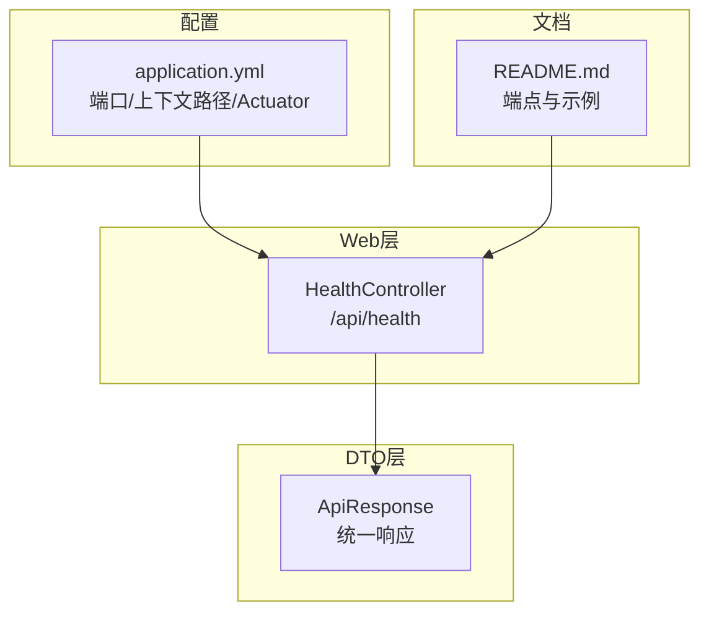
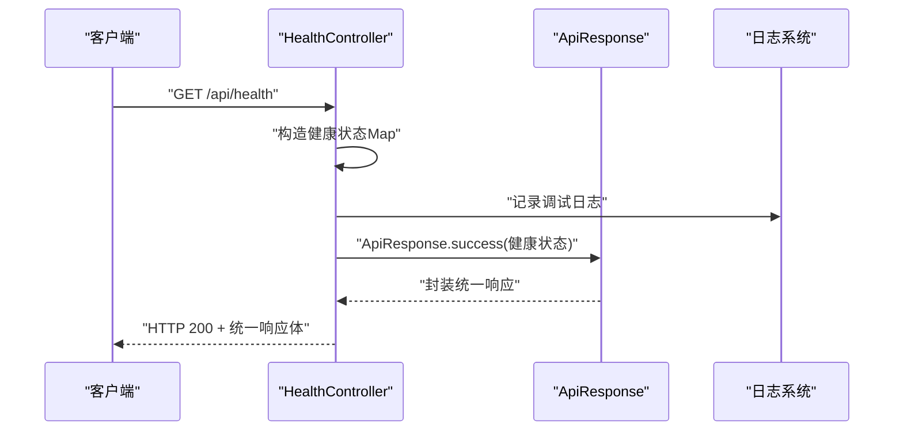
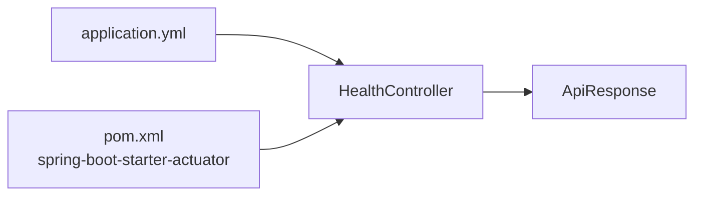

# 健康检查API

<cite>
**本文引用的文件**
- [HealthController.java](file://src/main/java/com/defi/aave/controller/HealthController.java)
- [ApiResponse.java](file://src/main/java/com/defi/aave/dto/ApiResponse.java)
- [application.yml](file://src/main/resources/application.yml)
- [README.md](file://README.md)
- [pom.xml](file://pom.xml)
</cite>

## 目录
1. [简介](#简介)
2. [项目结构](#项目结构)
3. [核心组件](#核心组件)
4. [架构总览](#架构总览)
5. [详细组件分析](#详细组件分析)
6. [依赖关系分析](#依赖关系分析)
7. [性能与日志考量](#性能与日志考量)
8. [运维集成指南](#运维集成指南)
9. [故障排查](#故障排查)
10. [结论](#结论)

## 简介
本文件面向HealthController中定义的健康检查相关RESTful API，提供系统级健康状态检查（GET /api/health）与欢迎信息接口（GET /api/health/welcome）的完整使用说明。内容涵盖：
- 响应结构与字段含义
- 统一响应格式ApiResponse的应用
- curl命令示例与HTTP请求/响应样例
- 与Kubernetes探针、Prometheus监控等运维场景的集成建议
- 无需认证即可访问的设计考虑与安全提示
- 日志记录级别在健康检查中的使用与影响

## 项目结构
- 控制器层位于controller包，其中HealthController提供健康检查与欢迎信息接口
- DTO层位于dto包，ApiResponse为统一响应载体
- 配置文件application.yml定义了服务端口、上下文路径、Actuator暴露端点等
- README.md提供了端点清单、示例与监控端点说明

图表来源
- [HealthController.java](file://src/main/java/com/defi/aave/controller/HealthController.java#L1-L47)
- [ApiResponse.java](file://src/main/java/com/defi/aave/dto/ApiResponse.java#L1-L79)
- [application.yml](file://src/main/resources/application.yml#L1-L79)
- [README.md](file://README.md#L128-L178)

章节来源
- [HealthController.java](file://src/main/java/com/defi/aave/controller/HealthController.java#L1-L47)
- [application.yml](file://src/main/resources/application.yml#L1-L79)
- [README.md](file://README.md#L128-L178)

## 核心组件
- 健康检查控制器（HealthController）
  - 路径前缀：/api/health
  - 方法：
    - GET /api/health 返回应用健康状态
    - GET /api/health/welcome 返回欢迎信息
- 统一响应载体（ApiResponse）
  - 所有接口返回统一结构：code、message、data
  - 健康检查与欢迎接口均通过ApiResponse.success(data)返回

章节来源
- [HealthController.java](file://src/main/java/com/defi/aave/controller/HealthController.java#L1-L47)
- [ApiResponse.java](file://src/main/java/com/defi/aave/dto/ApiResponse.java#L1-L79)

## 架构总览
健康检查API属于Web层对外提供的只读接口，不涉及业务数据持久化，因此耦合度低、稳定性高。其调用链路简洁，便于被外部系统直接消费。

图表来源
- [HealthController.java](file://src/main/java/com/defi/aave/controller/HealthController.java#L26-L36)
- [ApiResponse.java](file://src/main/java/com/defi/aave/dto/ApiResponse.java#L38-L56)

## 详细组件分析

### 健康检查接口（GET /api/health）
- 功能概述
  - 返回应用健康状态、时间戳、应用名称与版本等信息
  - 使用统一响应格式ApiResponse封装
- 响应结构（data字段）
  - status：字符串，表示应用健康状态（如“UP”）
  - timestamp：时间戳，表示健康检查执行时刻
  - application：应用名称
  - version：应用版本号
- 访问方式
  - 无需认证，适合外部监控系统直接拉取
- 日志行为
  - 在处理请求时记录调试级别的日志，便于问题定位但需注意避免日志风暴

章节来源
- [HealthController.java](file://src/main/java/com/defi/aave/controller/HealthController.java#L26-L36)
- [ApiResponse.java](file://src/main/java/com/defi/aave/dto/ApiResponse.java#L38-L56)

### 欢迎信息接口（GET /api/health/welcome）
- 功能概述
  - 返回简短的欢迎信息，用于快速验证服务可达性
- 响应结构（data字段）
  - 字符串类型，包含欢迎语
- 访问方式
  - 无需认证，适合快速连通性测试

章节来源
- [HealthController.java](file://src/main/java/com/defi/aave/controller/HealthController.java#L42-L45)
- [ApiResponse.java](file://src/main/java/com/defi/aave/dto/ApiResponse.java#L38-L56)

### 统一响应格式（ApiResponse）
- 结构组成
  - code：整数，HTTP语义上的状态码（此处以200表示成功）
  - message：字符串，描述性消息
  - data：泛型数据体
- 使用方式
  - 成功响应：ApiResponse.success(data)
  - 无数据成功：ApiResponse.success()
  - 错误响应：ApiResponse.error(message) 或 ApiResponse.error(code, message)
  - 客户端错误：ApiResponse.badRequest(message)

章节来源
- [ApiResponse.java](file://src/main/java/com/defi/aave/dto/ApiResponse.java#L1-L79)

## 依赖关系分析
- HealthController依赖ApiResponse进行统一响应封装
- 应用配置application.yml决定服务端口、上下文路径与Actuator暴露策略
- 项目引入Actuator依赖，便于在生产环境启用更完善的健康与指标端点

图表来源
- [HealthController.java](file://src/main/java/com/defi/aave/controller/HealthController.java#L1-L47)
- [ApiResponse.java](file://src/main/java/com/defi/aave/dto/ApiResponse.java#L1-L79)
- [application.yml](file://src/main/resources/application.yml#L1-L79)
- [pom.xml](file://pom.xml#L81-L85)

章节来源
- [pom.xml](file://pom.xml#L81-L85)
- [application.yml](file://src/main/resources/application.yml#L1-L79)

## 性能与日志考量
- 健康检查为只读、无数据库访问的轻量操作，响应延迟极低
- 日志级别
  - application.yml中对根日志级别为INFO，对com.defi.aave包设置为DEBUG
  - HealthController在处理健康检查时记录调试日志，有助于问题定位
- 建议
  - 在高并发场景下，适当降低日志级别或仅在问题排查时临时提升，避免日志风暴
  - 将健康检查端点暴露给外部监控系统时，建议配合限流与重试策略

章节来源
- [application.yml](file://src/main/resources/application.yml#L42-L53)
- [HealthController.java](file://src/main/java/com/defi/aave/controller/HealthController.java#L34-L35)

## 运维集成指南

### Kubernetes探针集成
- 建议使用livenessProbe与readinessProbe分别指向健康检查端点
- 探针配置要点
  - HTTP GET请求目标：/api/health
  - 成功条件：HTTP 200且响应体中data.status为“UP”
  - 超时与重试：根据集群规模与网络状况合理设置
- 说明
  - 该端点无需认证，适合容器内探针直接访问
  - 如需更细粒度的健康判断，可结合Actuator的/actuator/health端点

章节来源
- [README.md](file://README.md#L246-L254)
- [application.yml](file://src/main/resources/application.yml#L55-L63)

### Prometheus监控集成
- 指标采集
  - 可通过/actuator/metrics暴露JVM与应用指标，结合Prometheus抓取
- 健康状态展示
  - 健康检查端点可用于自定义告警规则，例如data.status非“UP”时触发告警
- 注意事项
  - 保持探针与监控系统的访问权限与网络连通性
  - 对于大规模集群，建议对健康检查端点进行限流与缓存友好设计

章节来源
- [README.md](file://README.md#L246-L254)
- [application.yml](file://src/main/resources/application.yml#L55-L63)

### curl命令示例与HTTP样例
- 健康检查
  - curl命令
    - curl http://localhost:8080/api/health
  - 请求/响应样例
    - 请求：GET /api/health
    - 响应：HTTP 200，响应体包含统一结构，data字段包含status、timestamp、application、version
- 欢迎信息
  - curl命令
    - curl http://localhost:8080/api/health/welcome
  - 请求/响应样例
    - 请求：GET /api/health/welcome
    - 响应：HTTP 200，响应体包含统一结构，data为字符串类型的欢迎信息

章节来源
- [README.md](file://README.md#L160-L178)

## 故障排查
- 无法访问端点
  - 检查服务是否在8080端口启动，上下文路径是否为/api
  - 确认防火墙与网络策略允许访问
- 健康状态异常
  - 观察data.status是否为“UP”，否则结合应用日志定位问题
  - 若使用Kubernetes，检查探针超时与重试配置
- 日志过多
  - 适当提高日志级别或减少调试日志输出频率
  - 在生产环境谨慎开启DEBUG级别日志

章节来源
- [application.yml](file://src/main/resources/application.yml#L42-L53)
- [HealthController.java](file://src/main/java/com/defi/aave/controller/HealthController.java#L34-L35)

## 结论
- 健康检查API以最小成本提供系统健康状态与可达性验证能力
- 通过统一响应格式，保证前后端交互一致性
- 无需认证的设计便于外部监控系统集成，但需结合网络安全策略与访问控制
- 建议在生产环境中结合Actuator端点与更丰富的监控体系，形成多层次可观测性