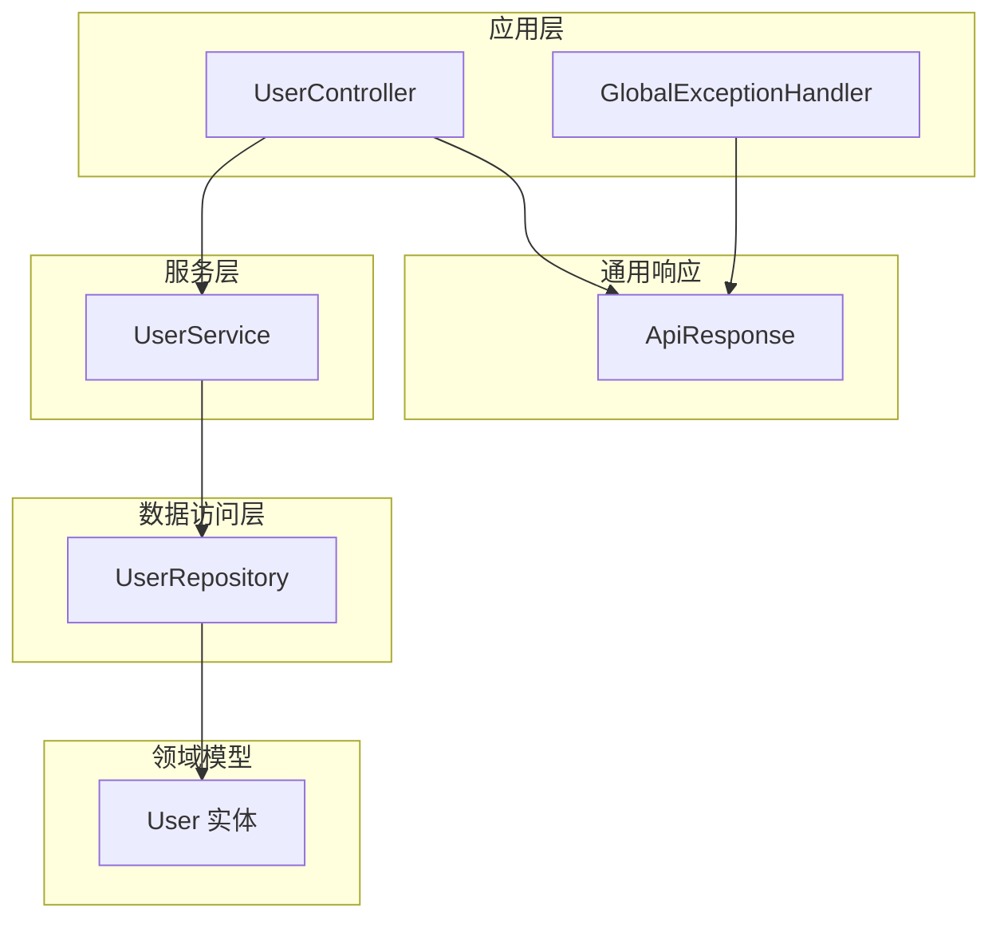
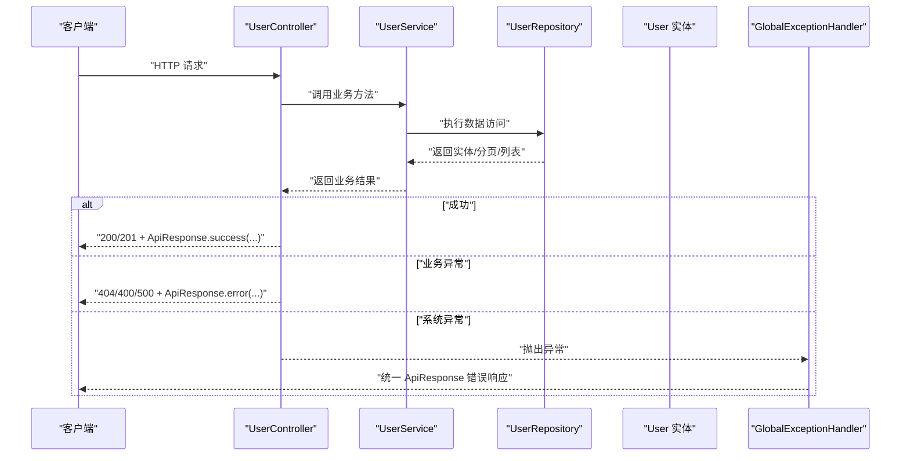
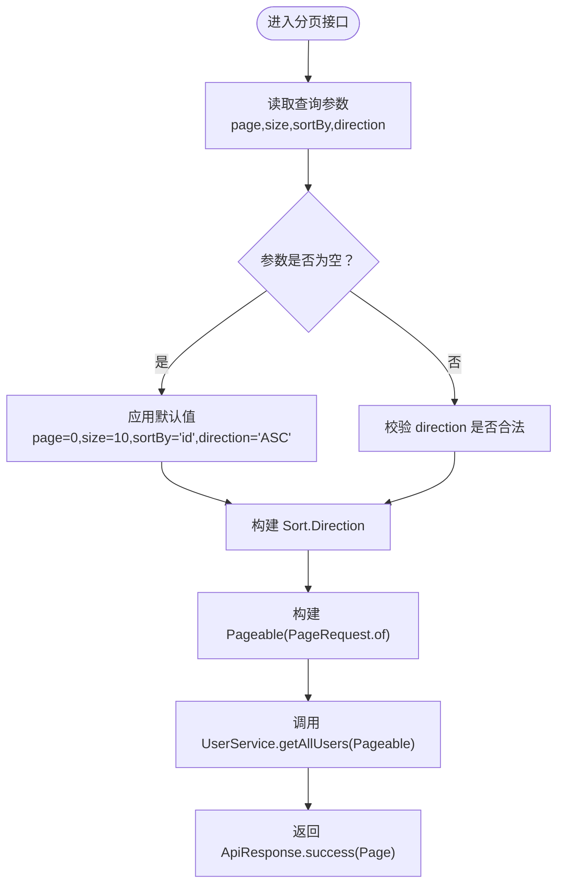
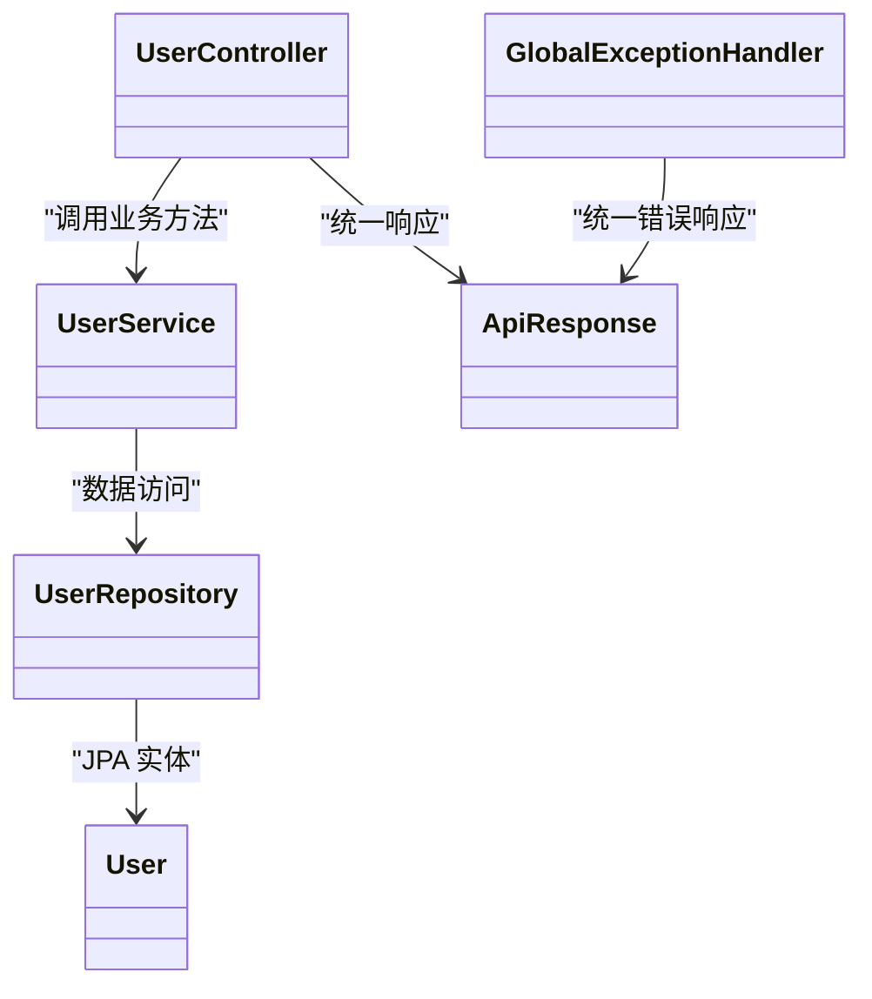

# 用户管理API

<cite>
**本文引用的文件**
- [UserController.java](file://src/main/java/com/defi/aave/controller/UserController.java)
- [UserService.java](file://src/main/java/com/defi/aave/service/UserService.java)
- [UserRepository.java](file://src/main/java/com/defi/aave/repository/UserRepository.java)
- [User.java](file://src/main/java/com/defi/aave/entity/User.java)
- [ApiResponse.java](file://src/main/java/com/defi/aave/dto/ApiResponse.java)
- [GlobalExceptionHandler.java](file://src/main/java/com/defi/aave/exception/GlobalExceptionHandler.java)
- [application.yml](file://src/main/resources/application.yml)
</cite>

## 目录
1. [简介](#简介)
2. [项目结构](#项目结构)
3. [核心组件](#核心组件)
4. [架构总览](#架构总览)
5. [详细接口文档](#详细接口文档)
6. [依赖分析](#依赖分析)
7. [性能考虑](#性能考虑)
8. [故障排查指南](#故障排查指南)
9. [结论](#结论)

## 简介
本文件面向 UserController 中定义的用户管理相关 RESTful API，提供从 HTTP 方法、URL 路径、请求参数、请求体结构、响应格式到状态码的完整说明。重点覆盖：
- 创建用户（POST /users）
- 获取指定用户（GET /users/{id}）
- 查询所有用户（GET /users）
- 分页查询用户（GET /users/page）
- 搜索用户（通过 keyword 参数）
- 获取活跃用户（GET /users/active）
- 更新用户（PUT /users/{id}）
- 删除用户（DELETE /users/{id}）
- 获取用户数量（GET /users/count）

同时解释分页参数默认值与排序方向处理逻辑；说明 @Valid 注解在创建与更新时的数据验证作用；阐述全局异常处理器如何统一处理业务异常与系统错误；并给出 ApiResponse.success() 与 ApiResponse.error()/badRequest() 的使用场景。

## 项目结构
后端采用典型的分层架构：控制器（Controller）负责接收请求与返回统一响应；服务层（Service）封装业务逻辑；数据访问层（Repository）基于 Spring Data JPA；实体（Entity）映射数据库表；统一响应 DTO（ApiResponse）封装所有接口返回结构；全局异常处理器（GlobalExceptionHandler）集中处理各类异常。

图表来源
- [UserController.java](file://src/main/java/com/defi/aave/controller/UserController.java#L1-L190)
- [UserService.java](file://src/main/java/com/defi/aave/service/UserService.java#L1-L158)
- [UserRepository.java](file://src/main/java/com/defi/aave/repository/UserRepository.java#L1-L55)
- [User.java](file://src/main/java/com/defi/aave/entity/User.java#L1-L54)
- [ApiResponse.java](file://src/main/java/com/defi/aave/dto/ApiResponse.java#L1-L77)
- [GlobalExceptionHandler.java](file://src/main/java/com/defi/aave/exception/GlobalExceptionHandler.java#L1-L98)

章节来源
- [application.yml](file://src/main/resources/application.yml#L1-L20)

## 核心组件
- 统一响应结构 ApiResponse<T>
  - 字段：code（整数）、message（字符串）、data（泛型）
  - 成功构造：success(data)、success(message, data)、success()
  - 错误构造：error(message)、error(code, message)、badRequest(message)
- 控制器 UserController
  - 所有接口均返回 ResponseEntity<ApiResponse<T>>
  - 使用 @Valid 对请求体进行参数校验
  - 使用 @PathVariable、@RequestParam 接收路径与查询参数
- 服务层 UserService
  - 封装业务逻辑：创建、查询、更新、删除、统计、分页、搜索、活跃用户
  - 使用 @Transactional 保证事务一致性
- 数据访问层 UserRepository
  - 基于 JPA 的标准 CRUD 与自定义查询
  - 自定义搜索：按用户名或邮箱包含关键字查询
- 全局异常处理器 GlobalExceptionHandler
  - 处理参数校验失败、约束违反、运行时异常、非法参数、通用异常
  - 统一返回 ApiResponse 结构

章节来源
- [ApiResponse.java](file://src/main/java/com/defi/aave/dto/ApiResponse.java#L1-L77)
- [UserController.java](file://src/main/java/com/defi/aave/controller/UserController.java#L1-L190)
- [UserService.java](file://src/main/java/com/defi/aave/service/UserService.java#L1-L158)
- [UserRepository.java](file://src/main/java/com/defi/aave/repository/UserRepository.java#L1-L55)
- [GlobalExceptionHandler.java](file://src/main/java/com/defi/aave/exception/GlobalExceptionHandler.java#L1-L98)

## 架构总览
下图展示用户管理相关接口的调用链路与数据流：

图表来源
- [UserController.java](file://src/main/java/com/defi/aave/controller/UserController.java#L1-L190)
- [UserService.java](file://src/main/java/com/defi/aave/service/UserService.java#L1-L158)
- [UserRepository.java](file://src/main/java/com/defi/aave/repository/UserRepository.java#L1-L55)
- [GlobalExceptionHandler.java](file://src/main/java/com/defi/aave/exception/GlobalExceptionHandler.java#L1-L98)

## 详细接口文档

### 基础信息
- 基础路径：/api/users（由 server.servlet.context-path: /api 与 @RequestMapping("/users") 共同决定）
- 统一响应结构：ApiResponse<T>
  - code：200 表示成功；400 表示客户端错误；500 表示服务器错误
  - message：人类可读的消息
  - data：实际返回的数据对象或集合
- 分页参数默认值与排序方向
  - page 默认 0
  - size 默认 10
  - sortBy 默认 "id"
  - direction 默认 "ASC"（大小写不敏感，内部转换为 Sort.Direction）

章节来源
- [application.yml](file://src/main/resources/application.yml#L1-L10)
- [UserController.java](file://src/main/java/com/defi/aave/controller/UserController.java#L86-L108)
- [ApiResponse.java](file://src/main/java/com/defi/aave/dto/ApiResponse.java#L1-L77)

### 1) 创建用户
- HTTP 方法：POST
- URL：/api/users
- 请求体：User 实体（见“User 实体字段”）
- 成功响应：201 Created + ApiResponse.success(...)
- 可能状态码：201、400、500
- curl 示例：
  - curl -X POST http://localhost:8080/api/users -H "Content-Type: application/json" -d '{...}'
- JSON 请求样例（字段示意）：
  - { "username": "...", "email": "...", "fullName": "...", "walletAddress": "...", "balance": "...", "isActive": true/false }
- JSON 响应样例（成功）：
  - { "code": 200, "message": "...", "data": { ... } }
- 验证说明：
  - @Valid 在控制器层触发参数校验
  - 全局异常处理器捕获校验失败并返回 400
- 业务异常：
  - 用户名或邮箱重复会抛出运行时异常，返回 400 或 500

章节来源
- [UserController.java](file://src/main/java/com/defi/aave/controller/UserController.java#L31-L47)
- [UserService.java](file://src/main/java/com/defi/aave/service/UserService.java#L24-L46)
- [UserRepository.java](file://src/main/java/com/defi/aave/repository/UserRepository.java#L40-L54)
- [GlobalExceptionHandler.java](file://src/main/java/com/defi/aave/exception/GlobalExceptionHandler.java#L27-L60)

### 2) 获取指定用户
- HTTP 方法：GET
- URL：/api/users/{id}
- 路径参数：id（Long）
- 成功响应：200 OK + ApiResponse.success(user)
- 可能状态码：200、404、500
- curl 示例：
  - curl http://localhost:8080/api/users/1
- JSON 响应样例（成功）：
  - { "code": 200, "message": "...", "data": { ... } }
- 业务异常：
  - 未找到用户时返回 404

章节来源
- [UserController.java](file://src/main/java/com/defi/aave/controller/UserController.java#L49-L60)
- [UserService.java](file://src/main/java/com/defi/aave/service/UserService.java#L48-L54)
- [UserRepository.java](file://src/main/java/com/defi/aave/repository/UserRepository.java#L16-L23)

### 3) 查询所有用户
- HTTP 方法：GET
- URL：/api/users
- 查询参数：keyword（可选，String）
- 成功响应：200 OK + ApiResponse.success(list)
- 可能状态码：200、500
- curl 示例：
  - curl "http://localhost:8080/api/users?keyword=..."
- JSON 响应样例（成功）：
  - { "code": 200, "message": "...", "data": [ { ... }, { ... } ] }
- 逻辑说明：
  - 若 keyword 非空，则按用户名或邮箱包含关键字搜索
  - 否则返回全部用户

章节来源
- [UserController.java](file://src/main/java/com/defi/aave/controller/UserController.java#L62-L84)
- [UserService.java](file://src/main/java/com/defi/aave/service/UserService.java#L72-L102)
- [UserRepository.java](file://src/main/java/com/defi/aave/repository/UserRepository.java#L50-L54)

### 4) 分页查询用户
- HTTP 方法：GET
- URL：/api/users/page
- 查询参数：
  - page（默认 0）
  - size（默认 10）
  - sortBy（默认 "id"）
  - direction（默认 "ASC"，支持 "ASC"/"DESC"）
- 成功响应：200 OK + ApiResponse.success(Page<User>)
- 可能状态码：200、500
- curl 示例：
  - curl "http://localhost:8080/api/users/page?page=0&size=10&sortBy=id&direction=ASC"
- JSON 响应样例（成功）：
  - { "code": 200, "message": "...", "data": { "content": [ { ... } ], "number": 0, "size": 10, "totalElements": N, "totalPages": M, ... } }
- 排序方向处理逻辑：
  - 将 direction 字符串转换为 Sort.Direction（大小写不敏感）
  - 使用 Sort.by(sortDirection, sortBy) 构造排序规则
  - PageRequest.of(page, size, Sort) 生成 Pageable

章节来源
- [UserController.java](file://src/main/java/com/defi/aave/controller/UserController.java#L86-L108)
- [UserService.java](file://src/main/java/com/defi/aave/service/UserService.java#L80-L86)

### 5) 搜索用户
- HTTP 方法：GET
- URL：/api/users
- 查询参数：keyword（必填时传入）
- 成功响应：200 OK + ApiResponse.success(list)
- 可能状态码：200、500
- curl 示例：
  - curl "http://localhost:8080/api/users?keyword=..."
- JSON 响应样例（成功）：
  - { "code": 200, "message": "...", "data": [ { ... }, { ... } ] }
- 逻辑说明：
  - 通过 UserRepository.searchUsers(...) 实现用户名或邮箱包含关键字的模糊匹配

章节来源
- [UserController.java](file://src/main/java/com/defi/aave/controller/UserController.java#L62-L84)
- [UserService.java](file://src/main/java/com/defi/aave/service/UserService.java#L96-L102)
- [UserRepository.java](file://src/main/java/com/defi/aave/repository/UserRepository.java#L50-L54)

### 6) 获取活跃用户
- HTTP 方法：GET
- URL：/api/users/active
- 成功响应：200 OK + ApiResponse.success(list)
- 可能状态码：200、500
- curl 示例：
  - curl http://localhost:8080/api/users/active
- JSON 响应样例（成功）：
  - { "code": 200, "message": "...", "data": [ { ... }, { ... } ] }
- 逻辑说明：
  - 通过 UserRepository.findByIsActiveTrue() 返回 isActive=true 的用户列表

章节来源
- [UserController.java](file://src/main/java/com/defi/aave/controller/UserController.java#L110-L125)
- [UserService.java](file://src/main/java/com/defi/aave/service/UserService.java#L88-L94)
- [UserRepository.java](file://src/main/java/com/defi/aave/repository/UserRepository.java#L34-L38)

### 7) 更新用户
- HTTP 方法：PUT
- URL：/api/users/{id}
- 路径参数：id（Long）
- 请求体：User 实体（仅更新非空字段）
- 成功响应：200 OK + ApiResponse.success(...)
- 可能状态码：200、404、500
- curl 示例：
  - curl -X PUT http://localhost:8080/api/users/1 -H "Content-Type: application/json" -d '{...}'
- JSON 请求样例（字段示意）：
  - { "email": "...", "fullName": "...", "walletAddress": "...", "balance": "...", "isActive": true/false }
- JSON 响应样例（成功）：
  - { "code": 200, "message": "...", "data": { ... } }
- 业务异常：
  - 未找到用户时返回 404
  - 其他异常返回 500

章节来源
- [UserController.java](file://src/main/java/com/defi/aave/controller/UserController.java#L127-L150)
- [UserService.java](file://src/main/java/com/defi/aave/service/UserService.java#L105-L134)
- [UserRepository.java](file://src/main/java/com/defi/aave/repository/UserRepository.java#L16-L23)

### 8) 删除用户
- HTTP 方法：DELETE
- URL：/api/users/{id}
- 路径参数：id（Long）
- 成功响应：200 OK + ApiResponse.success(...)
- 可能状态码：200、404、500
- curl 示例：
  - curl -X DELETE http://localhost:8080/api/users/1
- JSON 响应样例（成功）：
  - { "code": 200, "message": "...", "data": null }
- 业务异常：
  - 未找到用户时返回 404
  - 其他异常返回 500

章节来源
- [UserController.java](file://src/main/java/com/defi/aave/controller/UserController.java#L151-L171)
- [UserService.java](file://src/main/java/com/defi/aave/service/UserService.java#L136-L150)
- [UserRepository.java](file://src/main/java/com/defi/aave/repository/UserRepository.java#L16-L23)

### 9) 获取用户数量
- HTTP 方法：GET
- URL：/api/users/count
- 成功响应：200 OK + ApiResponse.success(count)
- 可能状态码：200、500
- curl 示例：
  - curl http://localhost:8080/api/users/count
- JSON 响应样例（成功）：
  - { "code": 200, "message": "...", "data": 123 }
- 逻辑说明：
  - 通过 UserRepository.count() 返回总数

章节来源
- [UserController.java](file://src/main/java/com/defi/aave/controller/UserController.java#L173-L188)
- [UserService.java](file://src/main/java/com/defi/aave/service/UserService.java#L151-L156)
- [UserRepository.java](file://src/main/java/com/defi/aave/repository/UserRepository.java#L16-L23)

### User 实体字段
- 字段说明（来自 User 实体）：
  - id：主键（Long）
  - username：用户名（非空、唯一、长度限制）
  - email：邮箱（非空、唯一、长度限制）
  - fullName：全名（长度限制）
  - walletAddress：钱包地址（唯一、长度限制）
  - balance：余额（精度与刻度）
  - isActive：是否激活（布尔，默认 true）
  - createdAt：创建时间（自动注入）
  - updatedAt：更新时间（自动注入）
- 注意：请求体中的字段以 JSON 形式提交，字段名需与实体一致。

章节来源
- [User.java](file://src/main/java/com/defi/aave/entity/User.java#L1-L54)

### 分页参数默认值与排序方向处理流程

图表来源
- [UserController.java](file://src/main/java/com/defi/aave/controller/UserController.java#L86-L108)
- [UserService.java](file://src/main/java/com/defi/aave/service/UserService.java#L80-L86)

## 依赖分析
- 控制器依赖服务层，服务层依赖数据访问层，数据访问层依赖实体
- 统一响应结构由 ApiResponse 提供，全局异常处理器统一拦截异常并返回 ApiResponse
- 分页与排序依赖 Spring Data 的 Sort 与 PageRequest

图表来源
- [UserController.java](file://src/main/java/com/defi/aave/controller/UserController.java#L1-L190)
- [UserService.java](file://src/main/java/com/defi/aave/service/UserService.java#L1-L158)
- [UserRepository.java](file://src/main/java/com/defi/aave/repository/UserRepository.java#L1-L55)
- [User.java](file://src/main/java/com/defi/aave/entity/User.java#L1-L54)
- [ApiResponse.java](file://src/main/java/com/defi/aave/dto/ApiResponse.java#L1-L77)
- [GlobalExceptionHandler.java](file://src/main/java/com/defi/aave/exception/GlobalExceptionHandler.java#L1-L98)

## 性能考虑
- 分页查询建议设置合理的 size，避免一次性返回过多数据
- 排序字段应建立数据库索引以提升查询性能
- 搜索接口使用 LIKE 模糊匹配可能影响性能，建议对高频关键词建立索引或引入全文检索
- 事务范围控制：创建、更新、删除操作使用 @Transactional，注意长事务带来的锁竞争

## 故障排查指南
- 参数校验失败（400）
  - 触发条件：@Valid 校验失败或 Bean 约束违反
  - 处理方式：GlobalExceptionHandler 返回 ApiResponse.badRequest(...)
- 业务异常（404/500）
  - 触发条件：用户不存在、用户名/邮箱重复、其他运行时异常
  - 处理方式：控制器内捕获并返回 ApiResponse.error(...) 或 ApiResponse.badRequest(...)
- 通用异常（500）
  - 触发条件：未捕获的系统异常
  - 处理方式：GlobalExceptionHandler 返回 ApiResponse.error("...")

章节来源
- [GlobalExceptionHandler.java](file://src/main/java/com/defi/aave/exception/GlobalExceptionHandler.java#L27-L98)
- [UserController.java](file://src/main/java/com/defi/aave/controller/UserController.java#L31-L47)
- [UserController.java](file://src/main/java/com/defi/aave/controller/UserController.java#L127-L171)

## 结论
本文档系统梳理了 UserController 中用户管理相关接口的 HTTP 方法、URL、参数、请求体、响应与状态码，并结合服务层与数据访问层实现说明了分页与排序的默认行为、@Valid 注解的验证作用以及全局异常处理器的统一处理机制。建议在生产环境中为高频查询字段建立索引、合理设置分页 size 并完善日志监控，以获得更佳的性能与可观测性。