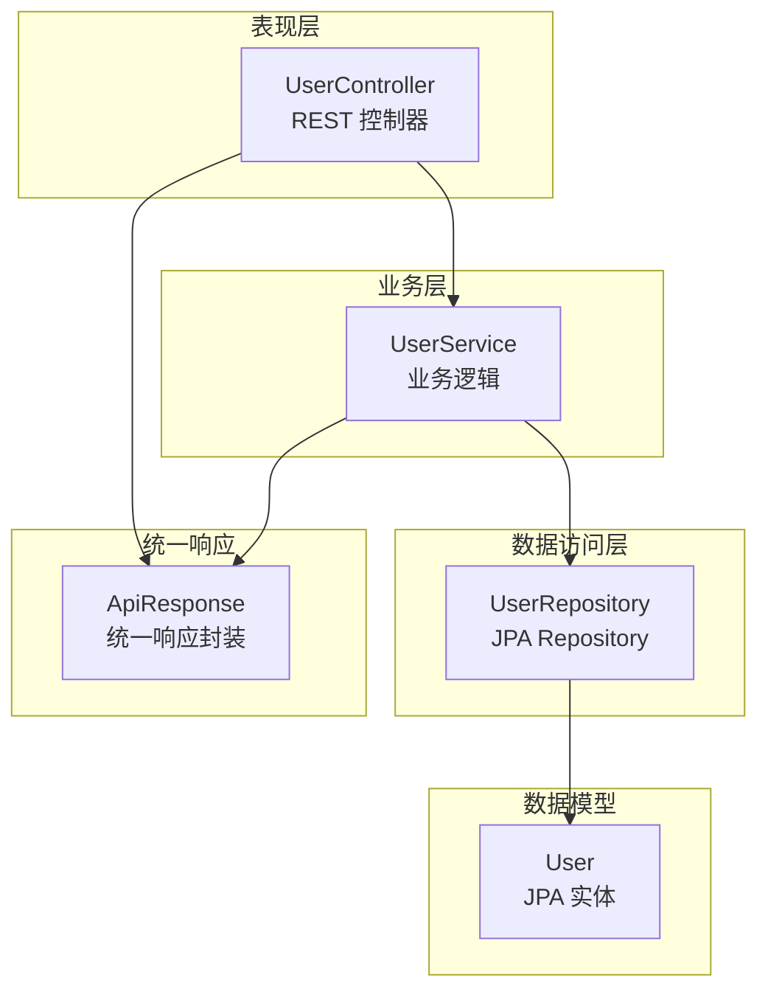
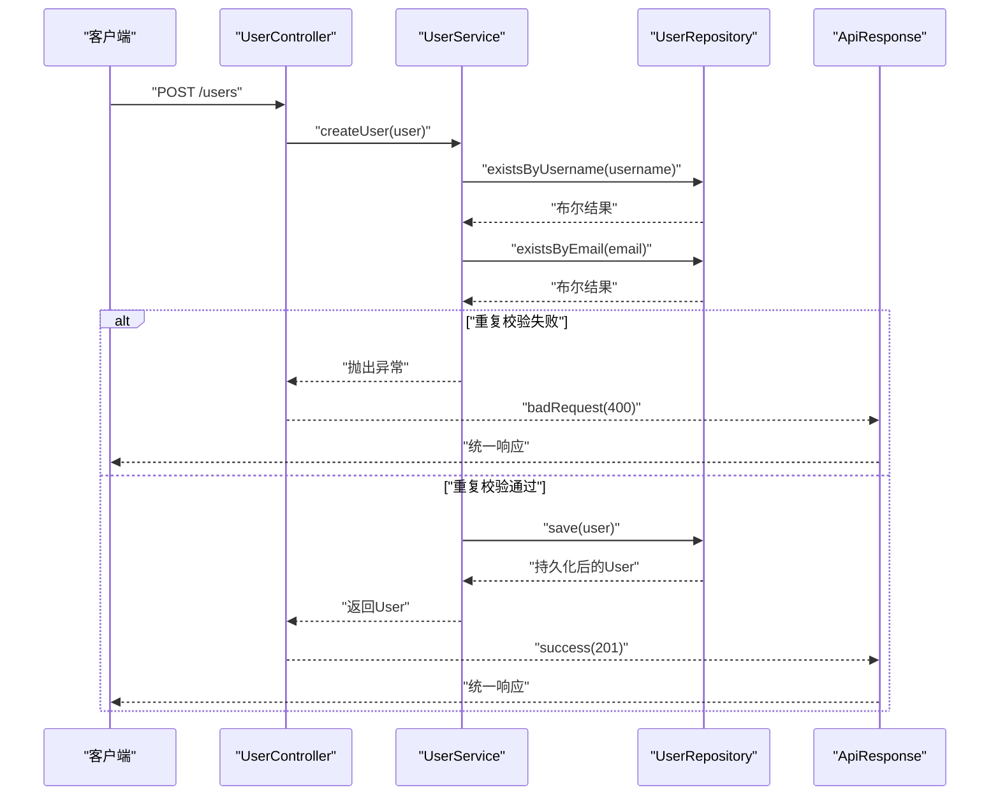
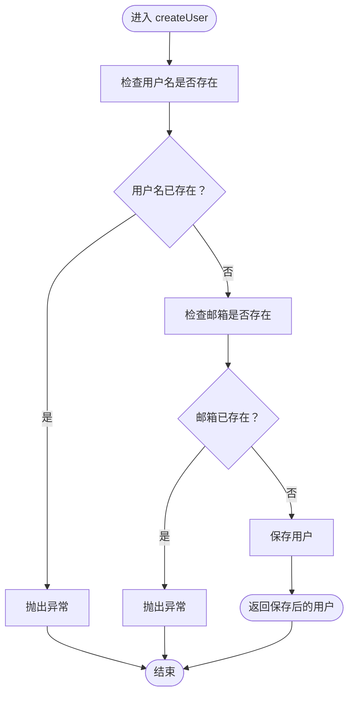
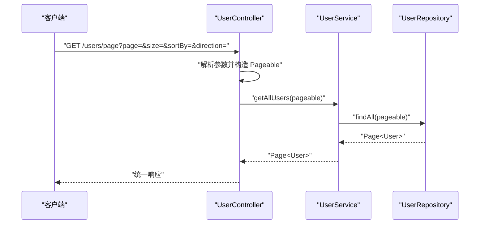
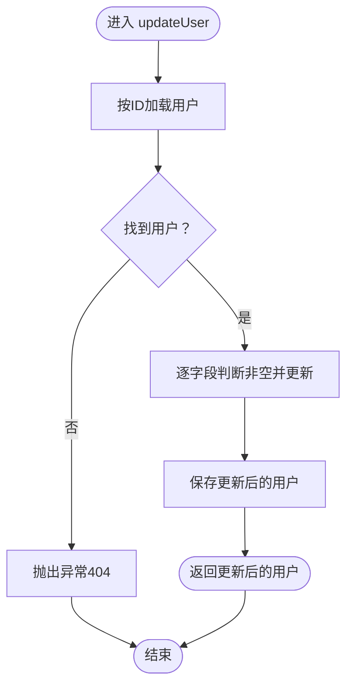
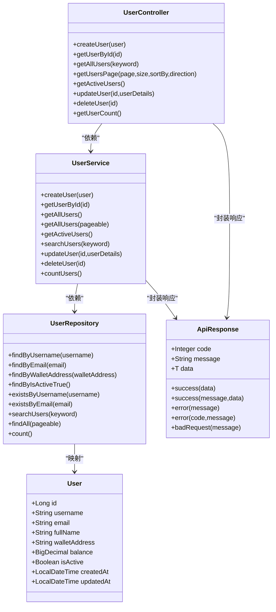

# 业务逻辑层

<cite>
**本文引用的文件列表**
- [UserService.java](file://src/main/java/com/defi/aave/service/UserService.java)
- [UserController.java](file://src/main/java/com/defi/aave/controller/UserController.java)
- [UserRepository.java](file://src/main/java/com/defi/aave/repository/UserRepository.java)
- [User.java](file://src/main/java/com/defi/aave/entity/User.java)
- [ApiResponse.java](file://src/main/java/com/defi/aave/dto/ApiResponse.java)
- [Application.java](file://src/main/java/com/defi/aave/Application.java)
- [README.md](file://README.md)
</cite>

## 目录
1. [简介](#简介)
2. [项目结构](#项目结构)
3. [核心组件](#核心组件)
4. [架构总览](#架构总览)
5. [详细组件分析](#详细组件分析)
6. [依赖关系分析](#依赖关系分析)
7. [性能考量](#性能考量)
8. [故障排查指南](#故障排查指南)
9. [结论](#结论)
10. [附录](#附录)

## 简介
本文件聚焦于业务逻辑层（Service）的实现，系统性解析 UserService 类中各项用户相关业务逻辑：用户创建、更新、删除、查询、分页、搜索以及活跃用户筛选。文档将阐明服务层如何协调数据访问层（Repository）以保证事务一致性（通过 @Transactional 注解），剖析关键方法的内部流程（如创建时的重复校验、更新时的空值处理策略、分页查询的 Pageable 参数使用），并说明服务层与控制器层（Controller）及数据访问层之间的职责划分与调用关系。同时，提供可扩展点建议，如未来可增加的业务验证规则或事件发布机制。

## 项目结构
该工程采用经典的三层架构：控制器层（Controller）、业务逻辑层（Service）、数据访问层（Repository），配合实体（Entity）与统一响应封装（DTO）共同构成完整的请求处理链路。

图表来源
- [UserController.java](file://src/main/java/com/defi/aave/controller/UserController.java#L1-L190)
- [UserService.java](file://src/main/java/com/defi/aave/service/UserService.java#L1-L158)
- [UserRepository.java](file://src/main/java/com/defi/aave/repository/UserRepository.java#L1-L55)
- [User.java](file://src/main/java/com/defi/aave/entity/User.java#L1-L54)
- [ApiResponse.java](file://src/main/java/com/defi/aave/dto/ApiResponse.java#L1-L77)

章节来源
- [README.md](file://README.md#L33-L58)
- [Application.java](file://src/main/java/com/defi/aave/Application.java#L1-L20)

## 核心组件
- 控制器层（UserController）
  - 负责接收 HTTP 请求、参数校验、组装统一响应、调用业务层并返回结果。
  - 关键职责：路由映射、分页参数构造（PageRequest、Sort）、状态码与消息体封装。
- 业务逻辑层（UserService）
  - 负责业务规则编排、事务控制、与数据访问层交互。
  - 关键职责：创建/更新/删除的业务校验与事务保障；查询聚合（分页、搜索、活跃用户）。
- 数据访问层（UserRepository）
  - 基于 Spring Data JPA 的接口，提供常用查询与自定义查询。
  - 关键职责：用户名/邮箱存在性检查、关键词搜索、活跃用户过滤、分页查询。
- 实体层（User）
  - JPA 实体，定义字段约束与时间戳。
- 统一响应（ApiResponse）
  - 规范化 API 返回结构，便于前后端对接与异常处理。

章节来源
- [UserController.java](file://src/main/java/com/defi/aave/controller/UserController.java#L1-L190)
- [UserService.java](file://src/main/java/com/defi/aave/service/UserService.java#L1-L158)
- [UserRepository.java](file://src/main/java/com/defi/aave/repository/UserRepository.java#L1-L55)
- [User.java](file://src/main/java/com/defi/aave/entity/User.java#L1-L54)
- [ApiResponse.java](file://src/main/java/com/defi/aave/dto/ApiResponse.java#L1-L77)

## 架构总览
下面的序列图展示了典型“创建用户”请求从控制器到服务再到数据访问层的完整调用链，以及事务控制与统一响应封装的协作关系。

图表来源
- [UserController.java](file://src/main/java/com/defi/aave/controller/UserController.java#L35-L47)
- [UserService.java](file://src/main/java/com/defi/aave/service/UserService.java#L29-L46)
- [UserRepository.java](file://src/main/java/com/defi/aave/repository/UserRepository.java#L41-L47)
- [ApiResponse.java](file://src/main/java/com/defi/aave/dto/ApiResponse.java#L38-L75)

## 详细组件分析

### 用户创建（createUser）
- 业务目标：创建新用户，确保用户名与邮箱唯一。
- 事务控制：使用 @Transactional，保证重复校验与保存在同一个事务内，避免中间状态被其他事务读取。
- 关键逻辑：
  - 先检查用户名是否存在，再检查邮箱是否存在；任一重复即抛出异常。
  - 通过 Repository.save 持久化用户。
- 边界情况：
  - 并发场景下，重复校验与保存之间仍可能产生竞态。当前实现依赖数据库唯一约束与服务层校验，但未使用悲观/乐观锁。若需更强一致性，可在 Repository 层引入唯一索引并在异常处理中区分“唯一约束冲突”与“其他异常”。

图表来源
- [UserService.java](file://src/main/java/com/defi/aave/service/UserService.java#L29-L46)
- [UserRepository.java](file://src/main/java/com/defi/aave/repository/UserRepository.java#L41-L47)

章节来源
- [UserService.java](file://src/main/java/com/defi/aave/service/UserService.java#L29-L46)
- [UserRepository.java](file://src/main/java/com/defi/aave/repository/UserRepository.java#L41-L47)

### 用户查询（按ID/用户名/邮箱/全部）
- 查询类型：
  - 按ID：Optional<User> findById
  - 按用户名：Optional<User> findByUsername
  - 按邮箱：Optional<User> findByEmail
  - 全部：List<User> findAll
- 事务控制：非事务方法，仅读取，无需 @Transactional。
- 边界情况：
  - 按ID查询不存在时，返回空 Optional；控制器侧根据是否存在进行 200/404 处理。

章节来源
- [UserService.java](file://src/main/java/com/defi/aave/service/UserService.java#L51-L78)
- [UserRepository.java](file://src/main/java/com/defi/aave/repository/UserRepository.java#L21-L37)
- [UserController.java](file://src/main/java/com/defi/aave/controller/UserController.java#L53-L60)

### 分页查询（getAllUsers + Pageable）
- 控制器侧：
  - 解析 page、size、sortBy、direction 参数，构造 Sort.Direction 与 PageRequest，形成 Pageable。
  - 将 Pageable 传入服务层。
- 服务层：
  - 直接委托给 Repository.findAll(Pageable)，返回 Page<User>。
- 边界情况：
  - 若排序字段非法，Sort.Direction.fromString 可能抛出异常；控制器捕获并返回 500 统一响应。

图表来源
- [UserController.java](file://src/main/java/com/defi/aave/controller/UserController.java#L90-L108)
- [UserService.java](file://src/main/java/com/defi/aave/service/UserService.java#L83-L86)
- [UserRepository.java](file://src/main/java/com/defi/aave/repository/UserRepository.java#L1-L20)

章节来源
- [UserController.java](file://src/main/java/com/defi/aave/controller/UserController.java#L90-L108)
- [UserService.java](file://src/main/java/com/defi/aave/service/UserService.java#L83-L86)
- [UserRepository.java](file://src/main/java/com/defi/aave/repository/UserRepository.java#L1-L20)

### 搜索用户（searchUsers）
- 控制器侧：
  - 支持可选 keyword 查询参数；若为空则走 getAllUsers，否则走 searchUsers。
- 服务层：
  - 直接调用 Repository.searchUsers(keyword)。
- Repository 层：
  - 使用原生 JPQL 查询，匹配 username 或 email。
- 边界情况：
  - keyword 为空或空白时，控制器选择不执行搜索，避免无效查询。

章节来源
- [UserController.java](file://src/main/java/com/defi/aave/controller/UserController.java#L66-L78)
- [UserService.java](file://src/main/java/com/defi/aave/service/UserService.java#L99-L102)
- [UserRepository.java](file://src/main/java/com/defi/aave/repository/UserRepository.java#L50-L54)

### 活跃用户筛选（getActiveUsers）
- 服务层：
  - 调用 Repository.findByIsActiveTrue。
- 适用场景：
  - 统计活跃用户、运营筛选、报表统计等。

章节来源
- [UserService.java](file://src/main/java/com/defi/aave/service/UserService.java#L91-L94)
- [UserRepository.java](file://src/main/java/com/defi/aave/repository/UserRepository.java#L34-L37)

### 用户更新（updateUser）
- 业务目标：按需更新用户字段，避免覆盖空值。
- 事务控制：使用 @Transactional，保证读取与保存在同一事务内。
- 空值处理策略：
  - 仅当 userDetails 对应字段非空时才更新目标 User 的对应属性。
  - 该策略避免了“空值回写导致历史数据被清空”的风险。
- 边界情况：
  - 若按ID找不到用户，抛出异常；控制器返回 404。
  - 若更新过程中发生异常，控制器返回 500。

图表来源
- [UserService.java](file://src/main/java/com/defi/aave/service/UserService.java#L107-L134)
- [UserRepository.java](file://src/main/java/com/defi/aave/repository/UserRepository.java#L1-L20)

章节来源
- [UserService.java](file://src/main/java/com/defi/aave/service/UserService.java#L107-L134)
- [UserRepository.java](file://src/main/java/com/defi/aave/repository/UserRepository.java#L1-L20)
- [UserController.java](file://src/main/java/com/defi/aave/controller/UserController.java#L131-L149)

### 用户删除（deleteUser）
- 业务目标：安全删除用户。
- 事务控制：使用 @Transactional，保证存在性检查与删除在同一事务内。
- 关键逻辑：
  - 先检查是否存在；不存在则抛异常。
  - 存在则删除。
- 边界情况：
  - 删除不存在的用户会抛异常；控制器返回 404。

章节来源
- [UserService.java](file://src/main/java/com/defi/aave/service/UserService.java#L139-L149)
- [UserRepository.java](file://src/main/java/com/defi/aave/repository/UserRepository.java#L1-L20)
- [UserController.java](file://src/main/java/com/defi/aave/controller/UserController.java#L155-L171)

### 用户计数（countUsers）
- 服务层：
  - 调用 Repository.count。
- 适用场景：
  - 统计用户总量、监控指标、报表汇总。

章节来源
- [UserService.java](file://src/main/java/com/defi/aave/service/UserService.java#L151-L156)
- [UserRepository.java](file://src/main/java/com/defi/aave/repository/UserRepository.java#L1-L20)

## 依赖关系分析
- 控制器依赖服务层：控制器负责参数解析与响应封装，业务逻辑集中在服务层。
- 服务层依赖数据访问层：服务层通过 Repository 接口完成数据读写与查询。
- 实体依赖 JPA 注解：User 实体定义字段约束与时间戳。
- 统一响应依赖：控制器与服务层均使用 ApiResponse 封装返回体。

图表来源
- [UserController.java](file://src/main/java/com/defi/aave/controller/UserController.java#L1-L190)
- [UserService.java](file://src/main/java/com/defi/aave/service/UserService.java#L1-L158)
- [UserRepository.java](file://src/main/java/com/defi/aave/repository/UserRepository.java#L1-L55)
- [User.java](file://src/main/java/com/defi/aave/entity/User.java#L1-L54)
- [ApiResponse.java](file://src/main/java/com/defi/aave/dto/ApiResponse.java#L1-L77)

## 性能考量
- 分页查询：
  - 使用 PageRequest + Sort 构造 Pageable，避免一次性加载全量数据，降低内存压力。
  - 建议在高频查询字段上建立数据库索引（如 username、email、is_active）以提升查询效率。
- 搜索查询：
  - Repository 的搜索使用 LIKE 模糊匹配，可能影响索引利用。可考虑全文检索或更精确的匹配策略。
- 事务范围：
  - @Transactional 包裹的创建、更新、删除操作保持原子性，但事务越长对数据库锁持有时间越长。建议尽量缩短事务内的业务逻辑，减少不必要的计算与IO。
- 并发与一致性：
  - 当前创建流程通过服务层校验与数据库唯一约束共同保障唯一性，但仍存在极短窗口的竞态风险。若业务对一致性要求极高，可考虑引入数据库级唯一索引与更严格的异常处理，或在高并发场景下引入分布式锁或幂等设计。

[本节为通用性能建议，不直接分析具体文件，故无章节来源]

## 故障排查指南
- 400 错误（参数校验失败）：
  - 控制器层对 @Valid 参数进行校验，若失败返回 badRequest。检查请求体字段是否符合实体约束。
- 404 错误（资源不存在）：
  - 更新或删除时若按ID查不到用户会抛异常；控制器返回 404。确认ID是否正确。
- 500 错误（服务器内部错误）：
  - 事务中发生的异常会被捕获并返回统一错误响应。查看日志定位具体异常原因（如排序字段非法、数据库约束冲突等）。
- 统一响应结构：
  - 所有接口返回 ApiResponse，包含 code、message、data。便于前端统一处理。

章节来源
- [UserController.java](file://src/main/java/com/defi/aave/controller/UserController.java#L35-L47)
- [UserController.java](file://src/main/java/com/defi/aave/controller/UserController.java#L53-L60)
- [UserController.java](file://src/main/java/com/defi/aave/controller/UserController.java#L90-L108)
- [UserController.java](file://src/main/java/com/defi/aave/controller/UserController.java#L131-L171)
- [ApiResponse.java](file://src/main/java/com/defi/aave/dto/ApiResponse.java#L1-L77)

## 结论
UserService 将业务规则与事务控制集中在服务层，清晰地实现了用户创建（含重复校验）、查询（单个/全部/分页/搜索/活跃）、更新（空值保护）、删除（存在性检查）与计数等核心能力。通过与控制器层和数据访问层的职责分离，系统具备良好的可维护性与扩展性。针对并发一致性与性能优化，建议在现有基础上引入数据库唯一索引、更严格的异常分类与必要的索引优化。

[本节为总结性内容，不直接分析具体文件，故无章节来源]

## 附录
- 可扩展点建议：
  - 业务验证增强：在创建/更新前加入更细粒度的业务规则（如邮箱格式、钱包地址合法性、余额范围等），并以独立校验器或 Bean Validation 注解形式实现。
  - 事件发布：在创建/更新/删除成功后发布领域事件（如 UserCreatedEvent、UserUpdatedEvent），供异步处理（如日志、通知、缓存同步）使用。
  - 幂等设计：对外暴露的创建/更新接口可引入幂等键（如客户端生成的请求ID），避免重复提交造成副作用。
  - 分布式锁：在高并发创建场景下，可引入 Redis/Lettuce 等分布式锁，进一步消除竞态条件。

[本节为概念性建议，不直接分析具体文件，故无章节来源]