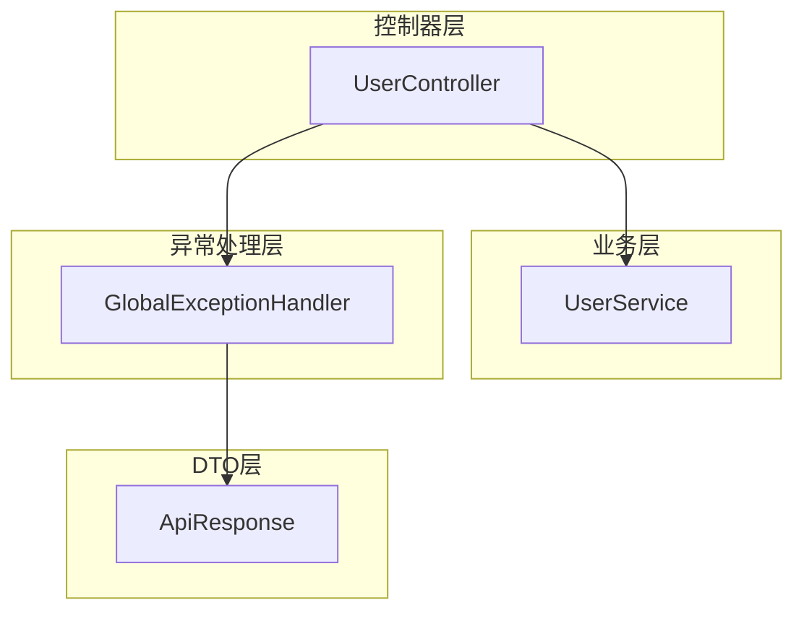
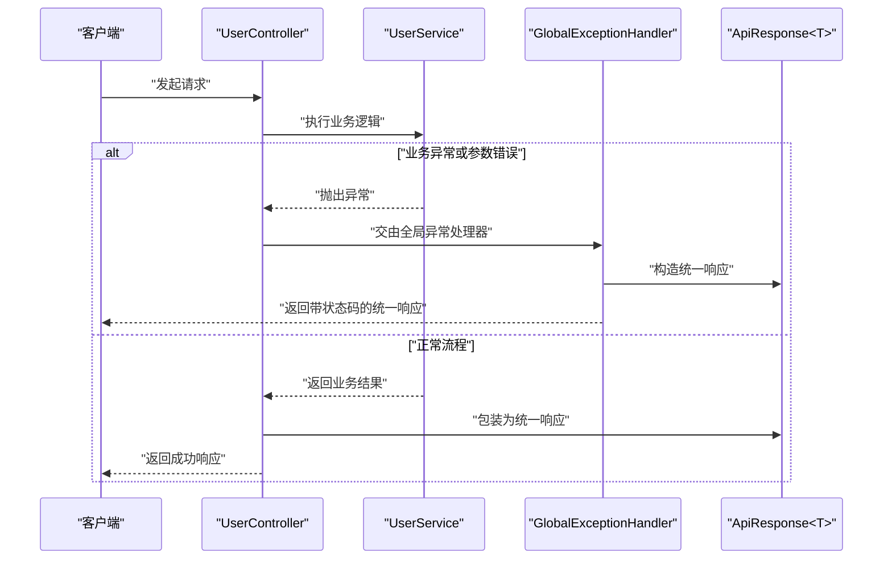
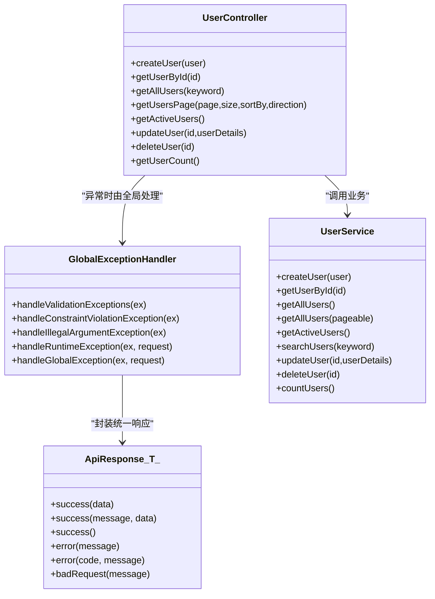

# 异常处理机制

<cite>
**本文引用的文件**
- [GlobalExceptionHandler.java](file://src/main/java/com/defi/aave/exception/GlobalExceptionHandler.java)
- [ApiResponse.java](file://src/main/java/com/defi/aave/dto/ApiResponse.java)
- [UserController.java](file://src/main/java/com/defi/aave/controller/UserController.java)
- [UserService.java](file://src/main/java/com/defi/aave/service/UserService.java)
- [application.yml](file://src/main/resources/application.yml)
</cite>

## 目录
1. [简介](#简介)
2. [项目结构](#项目结构)
3. [核心组件](#核心组件)
4. [架构总览](#架构总览)
5. [详细组件分析](#详细组件分析)
6. [依赖关系分析](#依赖关系分析)
7. [性能与可维护性考量](#性能与可维护性考量)
8. [故障排查指南](#故障排查指南)
9. [结论](#结论)
10. [附录：最佳实践与扩展建议](#附录最佳实践与扩展建议)

## 简介
本文件系统化阐述项目中全局异常捕获与统一响应处理的实现方式，重点围绕 GlobalExceptionHandler 类展开，解释其如何通过 @RestControllerAdvice 对所有控制器进行异常拦截与统一响应封装；并结合 ApiResponse 统一响应模型，说明不同异常类型（如参数校验失败、约束违反、非法参数、运行时异常等）的处理策略、HTTP 状态码选择依据、错误消息构造逻辑，以及对前端错误处理的友好性。同时给出自定义异常设计建议、日志记录实践、敏感信息过滤与堆栈暴露控制、国际化支持思路等最佳实践。

## 项目结构
项目采用典型的分层架构：
- 控制器层：对外提供 REST 接口，负责请求接收与响应返回
- 业务层：封装领域逻辑，可能抛出运行时异常
- 异常处理层：全局异常处理器，集中处理各类异常并输出统一响应
- DTO 层：统一响应模型，规范前后端交互数据结构

图表来源
- [UserController.java](file://src/main/java/com/defi/aave/controller/UserController.java#L1-L190)
- [UserService.java](file://src/main/java/com/defi/aave/service/UserService.java#L1-L158)
- [GlobalExceptionHandler.java](file://src/main/java/com/defi/aave/exception/GlobalExceptionHandler.java#L1-L98)
- [ApiResponse.java](file://src/main/java/com/defi/aave/dto/ApiResponse.java#L1-L77)

章节来源
- [application.yml](file://src/main/resources/application.yml#L1-L63)

## 核心组件
- 全局异常处理器：集中拦截控制器抛出的各类异常，统一转换为 ApiResponse 响应体，并设置合适的 HTTP 状态码
- 统一响应模型： ApiResponse<T> 提供 success/error/badRequest 等静态工厂方法，确保前后端一致的响应结构

章节来源
- [GlobalExceptionHandler.java](file://src/main/java/com/defi/aave/exception/GlobalExceptionHandler.java#L1-L98)
- [ApiResponse.java](file://src/main/java/com/defi/aave/dto/ApiResponse.java#L1-L77)

## 架构总览
下图展示了从控制器到异常处理器再到统一响应的整体调用链路：

图表来源
- [UserController.java](file://src/main/java/com/defi/aave/controller/UserController.java#L1-L190)
- [UserService.java](file://src/main/java/com/defi/aave/service/UserService.java#L1-L158)
- [GlobalExceptionHandler.java](file://src/main/java/com/defi/aave/exception/GlobalExceptionHandler.java#L1-L98)
- [ApiResponse.java](file://src/main/java/com/defi/aave/dto/ApiResponse.java#L1-L77)

## 详细组件分析

### 全局异常处理器（GlobalExceptionHandler）
- 作用范围与优势
  - 使用 @RestControllerAdvice 注解，使该类成为“全局控制器增强”，对所有控制器方法抛出的异常进行统一拦截与处理，避免在各控制器重复编写 try-catch 与响应封装逻辑，提升代码复用性与一致性
  - 跨控制器生效，无需在每个控制器单独声明异常映射，降低维护成本
- 处理策略概览
  - 参数校验失败（MethodArgumentNotValidException）：收集字段级错误，返回 400
  - Bean 级约束违反（ConstraintViolationException）：聚合约束违反信息，返回 400
  - 非法参数（IllegalArgumentException）：直接返回 400
  - 运行时异常（RuntimeException）：返回 500
  - 其他未匹配异常（Exception）：兜底返回 500
- HTTP 状态码选择依据
  - 400：客户端输入错误或参数不合法（校验失败、约束违反、非法参数）
  - 500：服务端内部错误（运行时异常、未预期异常）
- 错误消息构造逻辑
  - 校验失败：将字段名与错误消息映射为键值对，汇总为字符串
  - 约束违反：将多个约束违反消息拼接为字符串
  - 其他异常：直接使用异常消息或兜底提示
- 统一响应封装
  - 所有异常均通过 ApiResponse 的静态工厂方法构造统一响应体，包含 code、message、data 字段，便于前端统一解析与展示

章节来源
- [GlobalExceptionHandler.java](file://src/main/java/com/defi/aave/exception/GlobalExceptionHandler.java#L1-L98)

### 统一响应模型（ApiResponse<T>）
- 结构组成
  - code：状态码（200 成功、400 客户端错误、500 服务端错误）
  - message：响应消息
  - data：泛型数据体
- 工厂方法
  - success(data) / success(message, data) / success()：构造成功响应
  - error(message) / error(code, message)：构造错误响应
  - badRequest(message)：构造客户端错误响应
- 对前端的意义
  - 固定的数据结构，便于前端统一处理错误分支与成功分支
  - 前端可基于 code 判断页面提示与路由跳转策略

章节来源
- [ApiResponse.java](file://src/main/java/com/defi/aave/dto/ApiResponse.java#L1-L77)

### 控制器层（UserController）与业务层（UserService）
- 控制器层
  - 在业务异常场景中，控制器通常会捕获异常并返回统一响应；但全局异常处理器的存在使得控制器无需重复处理常见异常，异常可直接向上抛出，由全局处理器接管
  - 个别场景仍保留了控制器内的 try-catch 以覆盖特定业务分支，例如更新、删除用户时的 404 场景
- 业务层
  - UserService 在用户不存在、重复创建等场景抛出 RuntimeException，交由全局异常处理器统一处理
  - 业务层异常抛出遵循“明确语义”的原则，便于上层统一映射与前端提示

章节来源
- [UserController.java](file://src/main/java/com/defi/aave/controller/UserController.java#L1-L190)
- [UserService.java](file://src/main/java/com/defi/aave/service/UserService.java#L1-L158)

### 各类异常处理详解

#### 参数校验失败（MethodArgumentNotValidException）
- 触发条件
  - 控制器参数绑定阶段发生字段校验失败（如非空、长度限制、格式不符等）
- 处理逻辑
  - 收集所有字段级错误，形成“字段名 -> 错误消息”的映射
  - 返回 400，消息包含汇总后的错误集合
- HTTP 状态码依据
  - 400：客户端提交的请求参数不符合后端约束
- 错误消息构造
  - 将字段与对应错误消息组合，便于前端逐项提示

章节来源
- [GlobalExceptionHandler.java](file://src/main/java/com/defi/aave/exception/GlobalExceptionHandler.java#L1-L98)

#### Bean 级约束违反（ConstraintViolationException）
- 触发条件
  - 使用 Bean Validation 在入参对象上声明约束（如 @Min、@Pattern 等），在控制器方法参数上使用 @Validated 时触发
- 处理逻辑
  - 聚合所有约束违反消息，拼接为单一字符串
  - 返回 400
- HTTP 状态码依据
  - 400：客户端提交的请求体违反了预设约束
- 错误消息构造
  - 将多个约束违反信息合并，减少前端解析复杂度

章节来源
- [GlobalExceptionHandler.java](file://src/main/java/com/defi/aave/exception/GlobalExceptionHandler.java#L1-L98)

#### 非法参数（IllegalArgumentException）
- 触发条件
  - 传入了不被允许的参数值（如枚举取值不在允许范围内）
- 处理逻辑
  - 记录错误日志，返回 400
- HTTP 状态码依据
  - 400：客户端参数非法
- 错误消息构造
  - 直接使用异常消息，保持简洁明了

章节来源
- [GlobalExceptionHandler.java](file://src/main/java/com/defi/aave/exception/GlobalExceptionHandler.java#L1-L98)

#### 运行时异常（RuntimeException）
- 触发条件
  - 业务层或控制器内抛出的运行时异常（如用户不存在、重复创建等）
- 处理逻辑
  - 记录异常日志（含堆栈），返回 500
- HTTP 状态码依据
  - 500：服务端内部错误
- 错误消息构造
  - 使用异常消息或兜底提示，避免泄露过多细节

章节来源
- [GlobalExceptionHandler.java](file://src/main/java/com/defi/aave/exception/GlobalExceptionHandler.java#L1-L98)
- [UserService.java](file://src/main/java/com/defi/aave/service/UserService.java#L1-L158)

#### 其他未匹配异常（Exception）
- 触发条件
  - 未显式声明的其他异常
- 处理逻辑
  - 记录异常日志（含堆栈），返回 500
- HTTP 状态码依据
  - 500：未知或未预期错误
- 错误消息构造
  - 使用兜底提示，避免直接暴露底层异常细节

章节来源
- [GlobalExceptionHandler.java](file://src/main/java/com/defi/aave/exception/GlobalExceptionHandler.java#L1-L98)

### 统一响应格式对前端的便利性
- 固定结构：code、message、data 三段式结构，前端可按 code 分支处理
- 成功与错误统一：无论业务成功还是失败，响应结构一致，简化前端判断逻辑
- 可扩展性：data 支持泛型，既可用于列表、分页，也可用于单对象或空数据

章节来源
- [ApiResponse.java](file://src/main/java/com/defi/aave/dto/ApiResponse.java#L1-L77)

## 依赖关系分析
- GlobalExceptionHandler 依赖 ApiResponse 进行统一响应封装
- UserController 与 UserService 之间存在业务依赖，异常在业务层抛出，由全局处理器统一接管
- 日志框架（SLF4J）贯穿异常处理与业务层，便于问题定位

图表来源
- [GlobalExceptionHandler.java](file://src/main/java/com/defi/aave/exception/GlobalExceptionHandler.java#L1-L98)
- [ApiResponse.java](file://src/main/java/com/defi/aave/dto/ApiResponse.java#L1-L77)
- [UserController.java](file://src/main/java/com/defi/aave/controller/UserController.java#L1-L190)
- [UserService.java](file://src/main/java/com/defi/aave/service/UserService.java#L1-L158)

## 性能与可维护性考量
- 性能
  - 全局异常处理仅在异常路径触发，对正常路径无额外开销
  - 统一响应封装为轻量对象，序列化成本低
- 可维护性
  - 将异常处理集中在一处，减少重复代码
  - 通过 ApiResponse 统一结构，前端无需针对不同控制器适配不同的响应格式
- 可观测性
  - 使用日志记录异常消息与堆栈，便于快速定位问题

[本节为通用指导，不直接分析具体文件]

## 故障排查指南
- 如何确认异常是否被全局处理
  - 检查控制器是否抛出了异常且未在本地 try-catch 中消化
  - 查看日志中是否存在 GlobalExceptionHandler 的错误记录
- 常见问题定位
  - 参数校验失败：查看控制器参数上的校验注解与绑定结果
  - 约束违反：检查入参对象上的 Bean Validation 注解
  - 运行时异常：查看业务层抛出异常的位置与上下文
- 日志级别与输出
  - application.yml 中配置了日志级别，可在开发环境提高调试级别以便观察异常堆栈

章节来源
- [application.yml](file://src/main/resources/application.yml#L1-L63)

## 结论
本项目通过 @RestControllerAdvice 实现了跨控制器的全局异常捕获，配合 ApiResponse 统一响应模型，实现了“异常即服务”的一致化处理体验。不同异常类型映射到相应的 HTTP 状态码与消息，既满足前端统一处理的需求，也兼顾了安全与可维护性。建议在生产环境中进一步完善异常分类、敏感信息过滤与国际化支持，以提升系统的健壮性与用户体验。

[本节为总结性内容，不直接分析具体文件]

## 附录：最佳实践与扩展建议

### 自定义异常类设计建议
- 明确异常语义：区分“业务异常”与“技术异常”，前者用于表达业务规则违反，后者用于表达系统错误
- 统一异常结构：为自定义异常提供 code/message/data 字段，便于与 ApiResponse 协同工作
- 与业务状态码对齐：将业务异常映射到合理的 HTTP 状态码（如 400、404、409、500）

### 日志记录与问题排查
- 记录关键上下文：在异常处理器中记录异常消息与堆栈，必要时附加请求上下文信息（如用户 ID、请求路径）
- 控制敏感信息：避免在日志中输出密码、令牌、隐私数据等敏感字段
- 堆栈暴露控制：仅在开发/测试环境打印完整堆栈，在生产环境可使用摘要日志

### 国际化支持（i18n）
- 将错误消息与提示文案抽取为消息源（messages.properties），根据 Locale 返回对应语言的提示
- 在异常处理器中注入 MessageSource，按当前 Locale 解析消息模板
- 与 ApiResponse 结合，将 message 字段替换为本地化后的文本

### 安全与合规
- 避免泄露内部实现细节：统一返回通用错误提示，具体原因仅记录在日志中
- 对输入进行严格校验与清洗，减少异常发生的概率
- 对关键操作增加审计日志，便于事后追溯

[本节为通用指导，不直接分析具体文件]