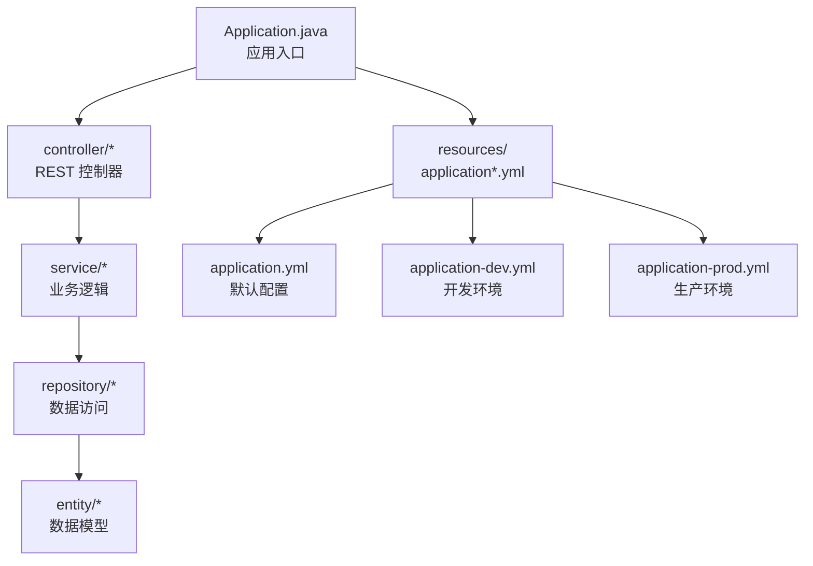
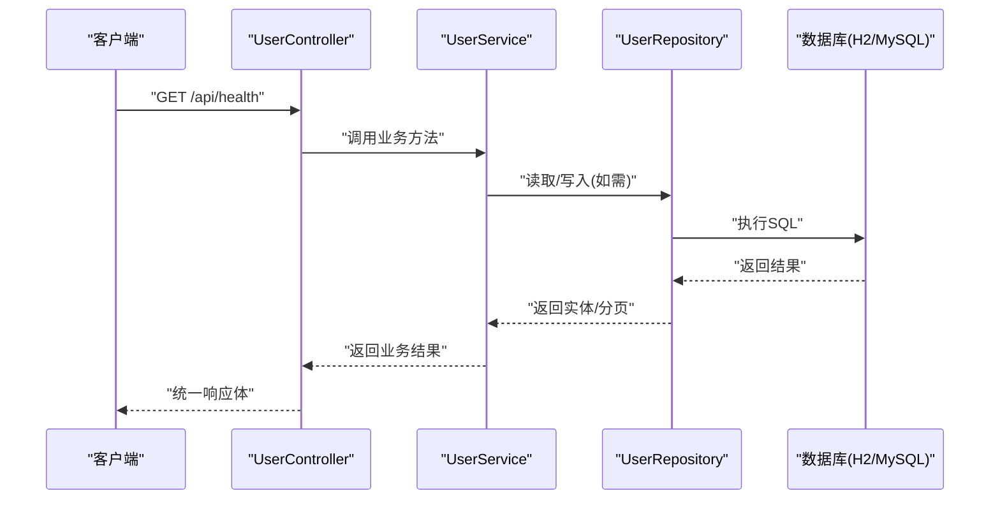
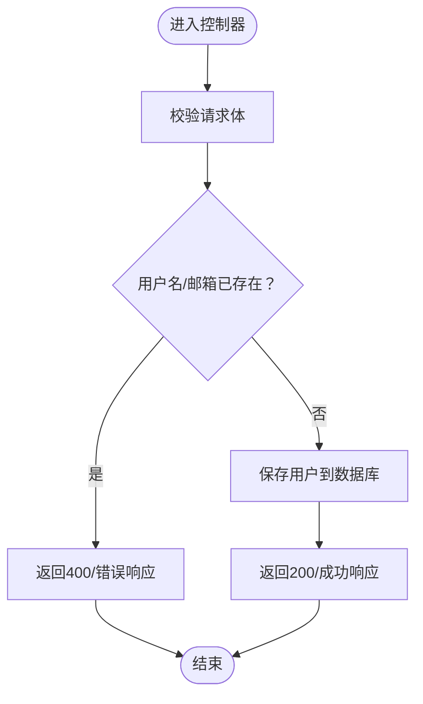

# 快速入门指南

<cite>
**本文引用的文件**
- [README.md](file://README.md)
- [pom.xml](file://pom.xml)
- [Application.java](file://src/main/java/com/defi/aave/Application.java)
- [application.yml](file://src/main/resources/application.yml)
- [application-dev.yml](file://src/main/resources/application-dev.yml)
- [application-prod.yml](file://src/main/resources/application-prod.yml)
- [HealthController.java](file://src/main/java/com/defi/aave/controller/HealthController.java)
- [UserController.java](file://src/main/java/com/defi/aave/controller/UserController.java)
- [ApiResponse.java](file://src/main/java/com/defi/aave/dto/ApiResponse.java)
- [User.java](file://src/main/java/com/defi/aave/entity/User.java)
- [UserService.java](file://src/main/java/com/defi/aave/service/UserService.java)
- [UserRepository.java](file://src/main/java/com/defi/aave/repository/UserRepository.java)
</cite>

## 目录
1. [简介](#简介)
2. [项目结构](#项目结构)
3. [核心组件](#核心组件)
4. [架构总览](#架构总览)
5. [详细组件分析](#详细组件分析)
6. [依赖分析](#依赖分析)
7. [性能与配置建议](#性能与配置建议)
8. [故障排查](#故障排查)
9. [结论](#结论)
10. [附录：API 使用示例](#附录api-使用示例)

## 简介
本指南面向新手开发者，帮助你在10分钟内完成 defi_aave 项目的本地环境准备、依赖下载、数据库配置（H2 或 MySQL）以及应用启动，并验证第一个 API 响应。你将学会：
- 准备 JDK 与 Maven 环境
- 克隆与构建项目
- 切换开发/生产环境
- 启动应用并访问健康检查与用户相关接口
- 使用 curl 或 Postman 进行测试
- 处理常见问题（端口冲突、依赖下载失败、数据库连接错误）

## 项目结构
该项目采用标准的 Spring Boot Maven 工程结构，按“控制器-服务-仓库-实体-数据传输对象”的分层组织代码；资源文件包含多环境配置。

图表来源
- [Application.java](file://src/main/java/com/defi/aave/Application.java#L1-L20)
- [HealthController.java](file://src/main/java/com/defi/aave/controller/HealthController.java#L1-L47)
- [UserController.java](file://src/main/java/com/defi/aave/controller/UserController.java#L1-L190)
- [UserService.java](file://src/main/java/com/defi/aave/service/UserService.java#L1-L158)
- [UserRepository.java](file://src/main/java/com/defi/aave/repository/UserRepository.java#L1-L55)
- [User.java](file://src/main/java/com/defi/aave/entity/User.java#L1-L54)
- [ApiResponse.java](file://src/main/java/com/defi/aave/dto/ApiResponse.java#L1-L77)
- [application.yml](file://src/main/resources/application.yml#L1-L79)
- [application-dev.yml](file://src/main/resources/application-dev.yml#L1-L27)
- [application-prod.yml](file://src/main/resources/application-prod.yml#L1-L34)

章节来源
- [README.md](file://README.md#L33-L58)
- [pom.xml](file://pom.xml#L1-L133)

## 核心组件
- 应用入口：负责启动 Spring Boot 应用。
- 控制器层：提供健康检查与用户管理接口。
- 服务层：封装业务逻辑，处理用户创建、查询、更新、删除与统计。
- 数据访问层：基于 Spring Data JPA，提供用户实体的持久化能力。
- 统一响应体：统一 API 返回结构，便于前后端对接。
- 配置文件：支持 dev/test/prod 多环境切换，默认使用 H2 内存数据库。

章节来源
- [Application.java](file://src/main/java/com/defi/aave/Application.java#L1-L20)
- [HealthController.java](file://src/main/java/com/defi/aave/controller/HealthController.java#L1-L47)
- [UserController.java](file://src/main/java/com/defi/aave/controller/UserController.java#L1-L190)
- [UserService.java](file://src/main/java/com/defi/aave/service/UserService.java#L1-L158)
- [UserRepository.java](file://src/main/java/com/defi/aave/repository/UserRepository.java#L1-L55)
- [ApiResponse.java](file://src/main/java/com/defi/aave/dto/ApiResponse.java#L1-L77)
- [application.yml](file://src/main/resources/application.yml#L1-L79)
- [application-dev.yml](file://src/main/resources/application-dev.yml#L1-L27)
- [application-prod.yml](file://src/main/resources/application-prod.yml#L1-L34)

## 架构总览
从请求到响应的关键流程如下：

图表来源
- [HealthController.java](file://src/main/java/com/defi/aave/controller/HealthController.java#L1-L47)
- [UserController.java](file://src/main/java/com/defi/aave/controller/UserController.java#L1-L190)
- [UserService.java](file://src/main/java/com/defi/aave/service/UserService.java#L1-L158)
- [UserRepository.java](file://src/main/java/com/defi/aave/repository/UserRepository.java#L1-L55)
- [ApiResponse.java](file://src/main/java/com/defi/aave/dto/ApiResponse.java#L1-L77)

## 详细组件分析

### 启动与运行
- 使用 Maven 插件启动：mvn spring-boot:run
- 直接运行打包后的 JAR：java -jar target/defi-aave-1.0.0.jar
- 默认访问地址：http://localhost:8080/api
- 健康检查端点：/api/health 与 /api/health/welcome
- Actuator 监控端点：/actuator（健康、信息、指标）

章节来源
- [README.md](file://README.md#L60-L91)
- [README.md](file://README.md#L128-L146)
- [README.md](file://README.md#L246-L255)
- [application.yml](file://src/main/resources/application.yml#L1-L20)

### 数据库配置与切换
- 开发环境（dev）：默认使用 H2 内存数据库，自动建表，H2 控制台地址：/api/h2-console
- 生产环境（prod）：使用 MySQL，需设置环境变量 DB_PASSWORD，连接池参数已优化
- 切换方式：修改 application.yml 中的 spring.profiles.active，或通过命令行参数传入

章节来源
- [README.md](file://README.md#L93-L127)
- [application.yml](file://src/main/resources/application.yml#L1-L20)
- [application-dev.yml](file://src/main/resources/application-dev.yml#L1-L27)
- [application-prod.yml](file://src/main/resources/application-prod.yml#L1-L34)

### API 端点与统一响应
- 统一响应体字段：code、message、data
- 健康检查：GET /api/health、GET /api/health/welcome
- 用户管理：POST /api/users、GET /api/users、GET /api/users/{id}、GET /api/users/active、GET /api/users/page、GET /api/users/count、PUT /api/users/{id}、DELETE /api/users/{id}

章节来源
- [README.md](file://README.md#L128-L146)
- [ApiResponse.java](file://src/main/java/com/defi/aave/dto/ApiResponse.java#L1-L77)
- [HealthController.java](file://src/main/java/com/defi/aave/controller/HealthController.java#L1-L47)
- [UserController.java](file://src/main/java/com/defi/aave/controller/UserController.java#L1-L190)

### 关键流程图：用户创建

图表来源
- [UserController.java](file://src/main/java/com/defi/aave/controller/UserController.java#L32-L47)
- [UserService.java](file://src/main/java/com/defi/aave/service/UserService.java#L27-L46)
- [UserRepository.java](file://src/main/java/com/defi/aave/repository/UserRepository.java#L40-L48)
- [ApiResponse.java](file://src/main/java/com/defi/aave/dto/ApiResponse.java#L66-L77)

## 依赖分析
- 核心框架：Spring Boot 2.7.18、Spring Web、Spring Data JPA、Hibernate ORM
- 数据库：H2（开发）、MySQL（生产）
- 工具：Lombok、DevTools、Validation、Actuator、Jackson、OkHttp、Caffeine
- 构建：Maven 插件用于打包与运行

章节来源
- [README.md](file://README.md#L12-L32)
- [pom.xml](file://pom.xml#L1-L133)

## 性能与配置建议
- 开发阶段使用 H2 内存数据库，无需额外安装，启动快。
- 生产环境使用 MySQL 并配置连接池参数，避免高并发下的连接瓶颈。
- 启用 Actuator 的健康与指标端点，便于监控应用状态。
- 调整日志级别以平衡可观测性与性能。

章节来源
- [application.yml](file://src/main/resources/application.yml#L43-L63)
- [application-prod.yml](file://src/main/resources/application-prod.yml#L1-L34)

## 故障排查
- 端口冲突（8080 被占用）
  - 修改 server.port 或释放占用进程
  - 参考：[application.yml](file://src/main/resources/application.yml#L4-L8)
- 依赖下载失败（网络/镜像问题）
  - 使用国内镜像源或代理，确保 Maven settings 正确
  - 参考：[pom.xml](file://pom.xml#L1-L133)
- 数据库连接错误（MySQL）
  - 确认 DB_PASSWORD 环境变量已设置
  - 确认 MySQL 服务已启动且账号密码正确
  - 参考：[application-prod.yml](file://src/main/resources/application-prod.yml#L6-L15)
- H2 控制台无法访问
  - 确认 dev 环境已启用 H2 控制台
  - 参考：[application.yml](file://src/main/resources/application.yml#L36-L41)
- 启动后无法访问 /api
  - 确认 context-path 为 /api
  - 参考：[application.yml](file://src/main/resources/application.yml#L5-L8)
- Actuator 端点不可见
  - 确认 management.endpoints.web.exposure.include 包含 health,info,metrics
  - 参考：[application.yml](file://src/main/resources/application.yml#L55-L63)

## 结论
按照本指南，你可以在10分钟内完成环境准备、项目启动与首次 API 验证。建议先使用 H2 开发环境快速上手，熟悉接口后再切换到 MySQL 生产环境进行集成测试。

## 附录：API 使用示例
- 健康检查
  - curl http://localhost:8080/api/health
  - 参考：[README.md](file://README.md#L160-L179)
- 创建用户
  - curl -X POST http://localhost:8080/api/users -H "Content-Type: application/json" -d '{...}'
  - 参考：[README.md](file://README.md#L180-L209)
- 获取用户详情
  - curl http://localhost:8080/api/users/{id}
  - 参考：[README.md](file://README.md#L211-L217)
- 获取所有用户
  - curl http://localhost:8080/api/users
  - 参考：[README.md](file://README.md#L218-L222)
- 分页获取用户
  - curl "http://localhost:8080/api/users/page?page=0&size=10&sortBy=id&direction=ASC"
  - 参考：[README.md](file://README.md#L223-L228)
- 更新用户
  - curl -X PUT http://localhost:8080/api/users/{id} -H "Content-Type: application/json" -d '{...}'
  - 参考：[README.md](file://README.md#L229-L239)
- 删除用户
  - curl -X DELETE http://localhost:8080/api/users/{id}
  - 参考：[README.md](file://README.md#L240-L245)

章节来源
- [README.md](file://README.md#L128-L245)