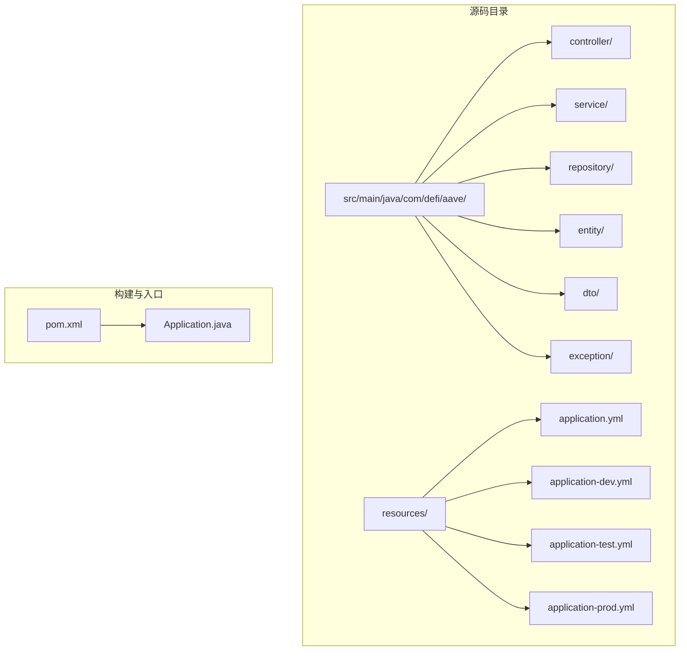
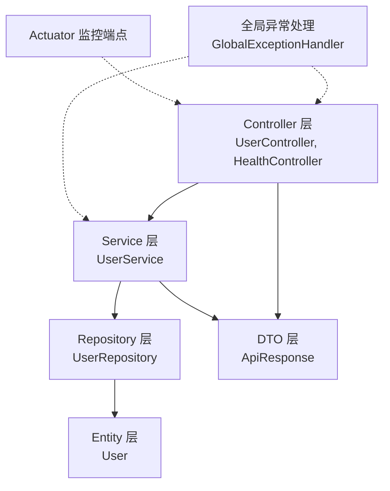
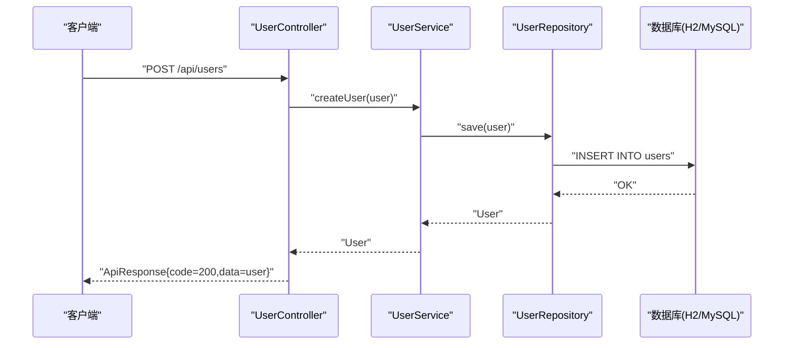
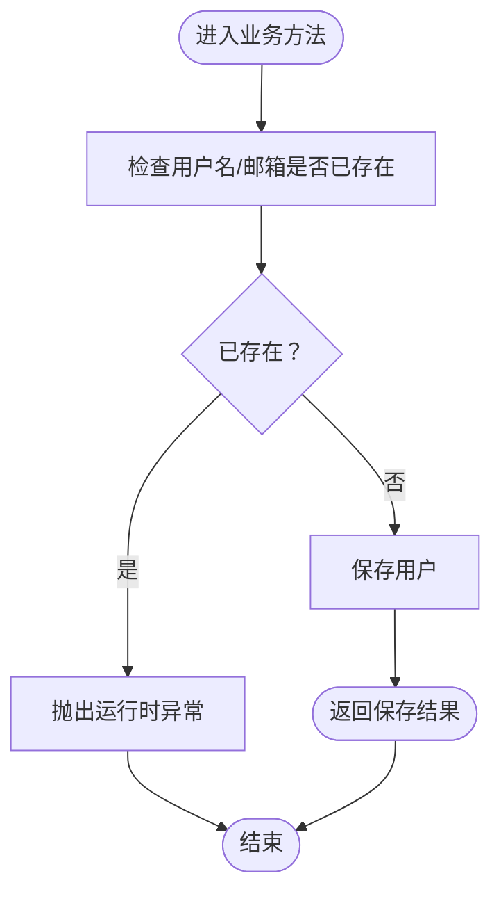
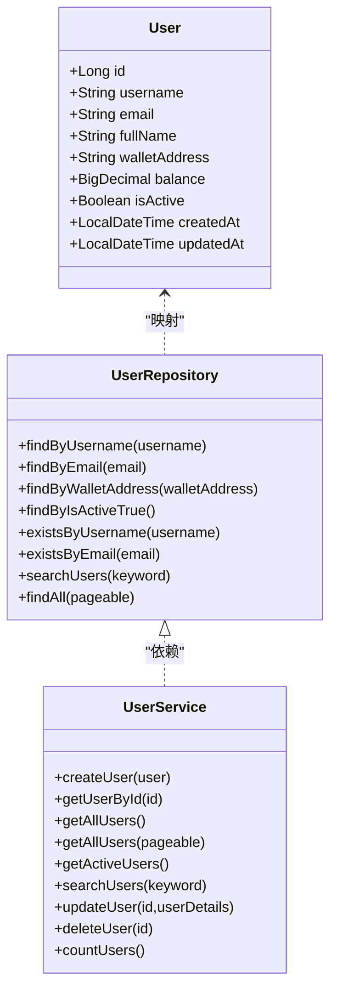
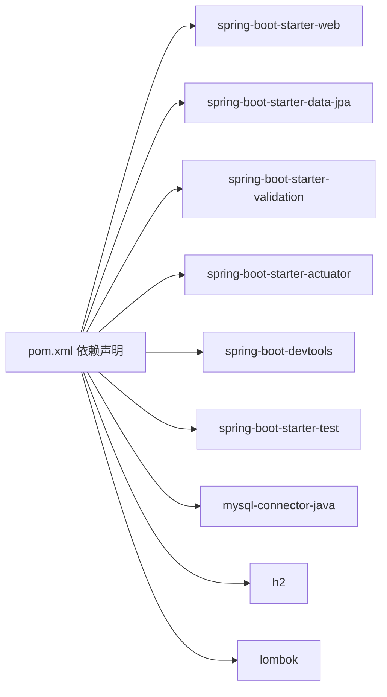

# 技术栈与依赖

<cite>
**本文引用的文件列表**
- [pom.xml](file://pom.xml)
- [README.md](file://README.md)
- [Application.java](file://src/main/java/com/defi/aave/Application.java)
- [application.yml](file://src/main/resources/application.yml)
- [application-dev.yml](file://src/main/resources/application-dev.yml)
- [application-test.yml](file://src/main/resources/application-test.yml)
- [application-prod.yml](file://src/main/resources/application-prod.yml)
- [HealthController.java](file://src/main/java/com/defi/aave/controller/HealthController.java)
- [UserController.java](file://src/main/java/com/defi/aave/controller/UserController.java)
- [UserService.java](file://src/main/java/com/defi/aave/service/UserService.java)
- [UserRepository.java](file://src/main/java/com/defi/aave/repository/UserRepository.java)
- [User.java](file://src/main/java/com/defi/aave/entity/User.java)
- [ApiResponse.java](file://src/main/java/com/defi/aave/dto/ApiResponse.java)
- [GlobalExceptionHandler.java](file://src/main/java/com/defi/aave/exception/GlobalExceptionHandler.java)
</cite>

## 目录
1. [引言](#引言)
2. [项目结构](#项目结构)
3. [核心组件](#核心组件)
4. [架构总览](#架构总览)
5. [详细组件分析](#详细组件分析)
6. [依赖分析](#依赖分析)
7. [性能考虑](#性能考虑)
8. [故障排查指南](#故障排查指南)
9. [结论](#结论)
10. [附录](#附录)

## 引言
本文件系统性梳理 defi_aave 项目的整体技术栈与依赖关系，重点围绕 Spring Boot 2.7.18 作为核心框架，阐述 Spring Web、Spring Data JPA、Lombok 等关键库的职责与集成方式；逐项说明 mysql-connector-java、H2 数据库、spring-boot-starter-validation、spring-boot-starter-actuator、spring-boot-devtools、spring-boot-starter-test 等外部依赖的功能定位与版本控制策略；并结合 Maven 的依赖管理与构建流程，给出技术选型的深入分析（如 JPA 与 MyBatis 的取舍、H2 在开发环境的优势、Actuator 的监控应用），最后覆盖依赖注入机制、编译运行所需的基础环境要求，帮助开发者快速理解并高效开展二次开发。

## 项目结构
项目采用标准 Maven 结构，按“分层架构”组织代码：controller（控制器）、service（业务层）、repository（数据访问层）、entity（实体模型）、dto（数据传输对象）、exception（全局异常处理）。资源文件位于 resources 下，包含多环境配置文件（dev/test/prod）及主配置 application.yml。

图表来源
- [pom.xml](file://pom.xml#L1-L113)
- [Application.java](file://src/main/java/com/defi/aave/Application.java#L1-L20)
- [application.yml](file://src/main/resources/application.yml#L1-L63)
- [application-dev.yml](file://src/main/resources/application-dev.yml#L1-L27)
- [application-test.yml](file://src/main/resources/application-test.yml#L1-L21)
- [application-prod.yml](file://src/main/resources/application-prod.yml#L1-L34)

章节来源
- [pom.xml](file://pom.xml#L1-L113)
- [README.md](file://README.md#L33-L58)

## 核心组件
- Spring Boot 2.7.18：作为项目父 POM，统一版本管理与插件配置，提供自动装配能力，简化 Web 与数据访问的初始化。
- Spring Web（spring-boot-starter-web）：提供 Web MVC 能力与内嵌 Tomcat，负责 REST API 的请求处理与响应封装。
- Spring Data JPA（spring-boot-starter-data-jpa）：提供 JPA 抽象与仓库模式，结合 Hibernate ORM 实现对象关系映射与数据库操作。
- Lombok：通过注解减少样板代码（如构造函数、getter/setter、日志等），提升开发效率。
- Spring Boot Validation（spring-boot-starter-validation）：提供 Bean Validation 支持，配合全局异常处理实现参数校验与约束校验的统一响应。
- Spring Boot Actuator（spring-boot-starter-actuator）：提供健康检查、指标收集等运维端点，便于监控与诊断。
- H2（runtime）：开发与测试环境的内存数据库，支持 H2 Console，便于本地调试与自动化测试。
- MySQL 驱动（runtime）：生产环境使用 MySQL，驱动版本固定以保证兼容性。
- DevTools（runtime）：热部署与开发体验增强。
- Test（test）：单元测试与集成测试支撑。

章节来源
- [pom.xml](file://pom.xml#L31-L93)
- [README.md](file://README.md#L12-L31)

## 架构总览
应用采用经典的三层架构：Web 层（Controller）接收请求，业务层（Service）处理领域逻辑，数据访问层（Repository + Entity）与数据库交互。统一响应体（ApiResponse）贯穿各层，全局异常处理器（GlobalExceptionHandler）集中处理各类异常，Actuator 提供健康与指标端点。

图表来源
- [UserController.java](file://src/main/java/com/defi/aave/controller/UserController.java#L1-L190)
- [HealthController.java](file://src/main/java/com/defi/aave/controller/HealthController.java#L1-L47)
- [UserService.java](file://src/main/java/com/defi/aave/service/UserService.java#L1-L158)
- [UserRepository.java](file://src/main/java/com/defi/aave/repository/UserRepository.java#L1-L55)
- [User.java](file://src/main/java/com/defi/aave/entity/User.java#L1-L54)
- [ApiResponse.java](file://src/main/java/com/defi/aave/dto/ApiResponse.java#L1-L77)
- [GlobalExceptionHandler.java](file://src/main/java/com/defi/aave/exception/GlobalExceptionHandler.java#L1-L98)

## 详细组件分析

### Spring Boot 启动与入口
- Application 类通过 @SpringBootApplication 注解启用自动装配与组件扫描，main 方法启动内嵌 Web 容器。
- 该入口是整个应用生命周期的起点，负责加载配置、初始化 Bean 并启动 Web 服务。

章节来源
- [Application.java](file://src/main/java/com/defi/aave/Application.java#L1-L20)

### Web 层（Spring Web）
- UserController：提供用户相关的 REST API（创建、查询、分页、搜索、更新、删除、计数），并使用 ApiResponse 统一响应结构。
- HealthController：提供应用健康检查与欢迎信息端点，便于快速验证服务可用性。
- 参数校验：Controller 层使用 @Valid 对入参进行校验，结合全局异常处理返回标准化错误信息。

图表来源
- [UserController.java](file://src/main/java/com/defi/aave/controller/UserController.java#L1-L190)
- [UserService.java](file://src/main/java/com/defi/aave/service/UserService.java#L1-L158)
- [UserRepository.java](file://src/main/java/com/defi/aave/repository/UserRepository.java#L1-L55)

章节来源
- [UserController.java](file://src/main/java/com/defi/aave/controller/UserController.java#L1-L190)
- [HealthController.java](file://src/main/java/com/defi/aave/controller/HealthController.java#L1-L47)

### 业务层（Spring Data JPA + Service）
- UserService：封装用户业务逻辑，包含存在性校验、分页查询、关键字搜索、更新字段选择性更新、删除前存在性检查等。
- 事务控制：对创建、更新、删除等写操作使用 @Transactional，确保数据一致性。
- 与 Repository 的协作：通过方法命名约定与自定义 @Query 实现复杂查询。

图表来源
- [UserService.java](file://src/main/java/com/defi/aave/service/UserService.java#L1-L158)
- [UserRepository.java](file://src/main/java/com/defi/aave/repository/UserRepository.java#L1-L55)

章节来源
- [UserService.java](file://src/main/java/com/defi/aave/service/UserService.java#L1-L158)

### 数据访问层（JPA + Hibernate）
- UserRepository：继承 JpaRepository，提供基础 CRUD 与分页查询；通过方法命名约定实现按字段查询与存在性判断；通过 @Query 实现模糊搜索。
- User 实体：使用 JPA 注解映射表结构，包含自增主键、唯一约束、精度控制、时间戳字段等。
- 配置要点：根据环境切换方言（H2/MySQL8）、DDL 策略（update/create-drop/validate）、SQL 输出与格式化等。

图表来源
- [User.java](file://src/main/java/com/defi/aave/entity/User.java#L1-L54)
- [UserRepository.java](file://src/main/java/com/defi/aave/repository/UserRepository.java#L1-L55)
- [UserService.java](file://src/main/java/com/defi/aave/service/UserService.java#L1-L158)

章节来源
- [UserRepository.java](file://src/main/java/com/defi/aave/repository/UserRepository.java#L1-L55)
- [User.java](file://src/main/java/com/defi/aave/entity/User.java#L1-L54)

### DTO 与统一响应
- ApiResponse：定义统一的响应结构（code/message/data），提供静态工厂方法生成不同类型的响应，贯穿 Controller 与 Service 层，保证对外输出的一致性。

章节来源
- [ApiResponse.java](file://src/main/java/com/defi/aave/dto/ApiResponse.java#L1-L77)

### 全局异常处理
- GlobalExceptionHandler：集中处理参数校验失败、约束违反、运行时异常、非法参数与通用异常，统一返回 ApiResponse 格式，避免重复错误处理逻辑。

章节来源
- [GlobalExceptionHandler.java](file://src/main/java/com/defi/aave/exception/GlobalExceptionHandler.java#L1-L98)

### 配置与环境管理
- application.yml：定义服务器端口、上下文路径、活动 profile、默认数据源（H2）、JPA 方言与 SQL 输出、日志级别、Actuator 暴露端点等。
- application-dev.yml：开发环境专用的数据源与 H2 Console 开启、SQL 输出与日志级别。
- application-test.yml：测试环境专用的数据源与 SQL 输出设置。
- application-prod.yml：生产环境专用的 MySQL 数据源、连接池参数、JPA 方言与 SQL 输出关闭、H2 Console 关闭、日志级别收敛。

章节来源
- [application.yml](file://src/main/resources/application.yml#L1-L63)
- [application-dev.yml](file://src/main/resources/application-dev.yml#L1-L27)
- [application-test.yml](file://src/main/resources/application-test.yml#L1-L21)
- [application-prod.yml](file://src/main/resources/application-prod.yml#L1-L34)

## 依赖分析
- Maven 管理策略
  - 使用 spring-boot-starter-parent 作为父 POM，统一版本与插件行为，避免版本冲突。
  - 显式声明核心依赖：spring-boot-starter-web、spring-boot-starter-data-jpa、spring-boot-starter-validation、spring-boot-starter-actuator、spring-boot-devtools、spring-boot-starter-test。
  - runtime 作用域：mysql-connector-java、h2，分别用于生产与开发/测试环境。
  - optional：lombok，仅参与编译期，打包时排除。
  - 插件：spring-boot-maven-plugin，负责打包可执行 JAR，并排除 Lombok。

- 外部依赖与功能定位
  - mysql-connector-java：生产环境 MySQL 驱动，版本固定为 8.0.33，确保与 MySQL 8+ 兼容。
  - h2：开发/测试环境内存数据库，支持 H2 Console，便于本地调试与自动化测试。
  - spring-boot-starter-validation：Bean Validation 与方法级参数校验，结合全局异常处理统一返回。
  - spring-boot-starter-actuator：暴露 health、info、metrics 等端点，便于健康检查与指标采集。
  - spring-boot-devtools：热部署与开发体验增强。
  - spring-boot-starter-test：测试框架支撑。

图表来源
- [pom.xml](file://pom.xml#L31-L93)

章节来源
- [pom.xml](file://pom.xml#L1-L113)

## 性能考虑
- 连接池与 SQL 输出
  - 生产环境使用 HikariCP 连接池参数（最大池大小、最小空闲、超时等），降低连接开销与等待时间。
  - 生产环境关闭 SQL 输出，减少日志体积与 I/O 开销。
- DDL 策略
  - 开发环境使用 create-drop/update，便于快速迭代；生产环境使用 validate，避免误改结构。
- 日志级别
  - 生产环境收敛日志级别，降低 CPU 与磁盘压力；开发环境开启 DEBUG 以便问题定位。
- Actuator
  - 仅暴露必要端点，避免敏感信息泄露；合理配置 show-details 策略。

章节来源
- [application-prod.yml](file://src/main/resources/application-prod.yml#L1-L34)
- [application-dev.yml](file://src/main/resources/application-dev.yml#L1-L27)
- [application.yml](file://src/main/resources/application.yml#L1-L63)

## 故障排查指南
- 健康检查
  - Web 层：/api/health、/api/health/welcome
  - Actuator：/actuator/health、/actuator/info、/actuator/metrics
- 数据库连接
  - 开发环境：确认 H2 Console 可访问，URL 与驱动一致；检查 DDL 策略与表结构自动生成。
  - 生产环境：确认 MySQL 密码、主机与端口、SSL 与时区参数；检查连接池参数与超时设置。
- 参数校验
  - 全局异常处理会将校验失败的字段与消息统一返回，便于前端提示与定位。
- 日志
  - 开发环境开启 DEBUG 与 SQL 输出；生产环境收敛日志级别，必要时临时提升以定位问题。

章节来源
- [HealthController.java](file://src/main/java/com/defi/aave/controller/HealthController.java#L1-L47)
- [GlobalExceptionHandler.java](file://src/main/java/com/defi/aave/exception/GlobalExceptionHandler.java#L1-L98)
- [application.yml](file://src/main/resources/application.yml#L1-L63)
- [application-prod.yml](file://src/main/resources/application-prod.yml#L1-L34)

## 结论
本项目以 Spring Boot 2.7.18 为核心，结合 Spring Web、Spring Data JPA、Lombok、Bean Validation、Actuator 等生态组件，构建了简洁、可维护且具备良好监控能力的 Web 应用骨架。通过多环境配置与明确的依赖管理策略，既满足开发调试需求，又兼顾生产环境的稳定性与可观测性。JPA 的使用降低了数据访问复杂度，H2 的引入提升了本地开发效率，Actuator 的集成完善了运维监控体系。建议在后续演进中持续关注 Spring 生态版本升级与安全补丁，保持依赖的及时更新与最小权限原则。

## 附录

### 技术选型分析
- 为什么选择 JPA 而非 MyBatis
  - JPA 提供面向对象的 ORM 抽象与仓库模式，减少 SQL 编写与手写 DAO 的样板代码；通过方法命名约定与 @Query 可灵活扩展查询；与 Spring Data JPA 协同实现分页、排序与条件查询。
  - MyBatis 更偏向 SQL 精细化控制，适合复杂报表与历史遗留系统；对于快速 CRUD 场景，JPA 已足够高效。
- 为什么选择 H2 作为开发环境数据库
  - 内存数据库无需安装与配置，启动即用；支持 H2 Console，便于调试；与 Spring Boot 自动装配无缝衔接；适合本地开发与 CI 测试。
- 为什么使用 Actuator
  - 提供健康检查、应用信息与指标端点，便于容器编排与平台监控；生产环境可限制暴露范围，兼顾安全与可观测性。

章节来源
- [README.md](file://README.md#L12-L31)
- [application.yml](file://src/main/resources/application.yml#L54-L63)
- [application-dev.yml](file://src/main/resources/application-dev.yml#L18-L21)
- [application-prod.yml](file://src/main/resources/application-prod.yml#L23-L27)

### 构建流程与运行要求
- 基础环境
  - Java 1.8 或更高版本，Maven 3.x。
- 构建与运行
  - 清理与编译：mvn clean compile
  - 打包：mvn clean package
  - 运行：mvn spring-boot:run 或 java -jar target/defi-aave-1.0.0.jar
  - 默认访问地址：http://localhost:8080/api
- 环境切换
  - 修改 application.yml 中的 spring.profiles.active，或通过命令行参数传入 --spring.profiles.active=dev|test|prod。

章节来源
- [README.md](file://README.md#L60-L91)
- [application.yml](file://src/main/resources/application.yml#L14-L16)