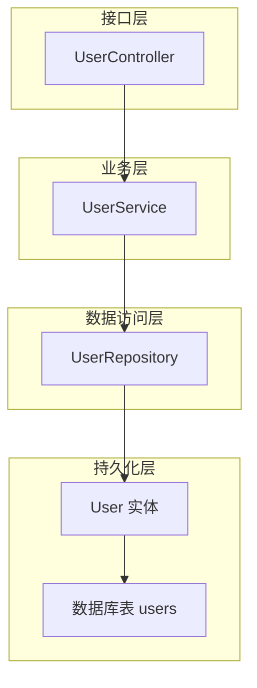
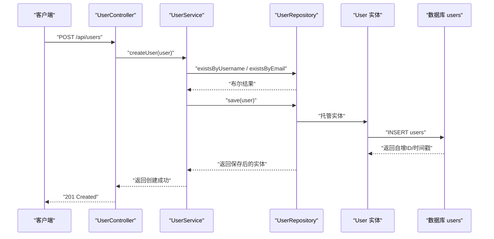
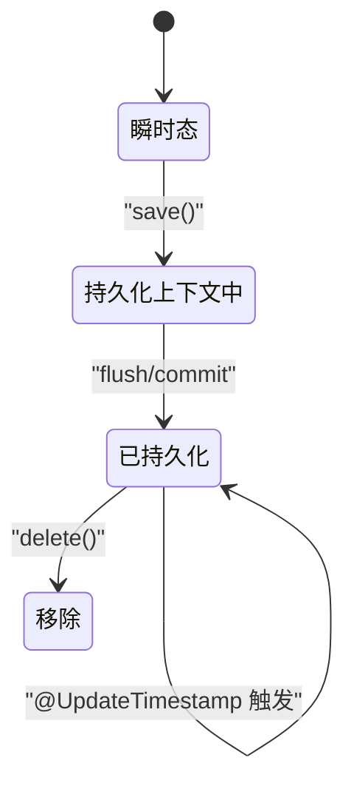
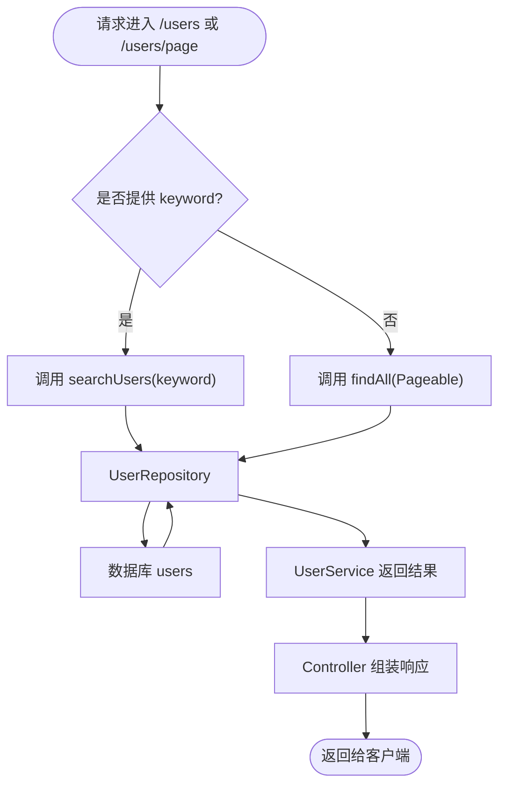
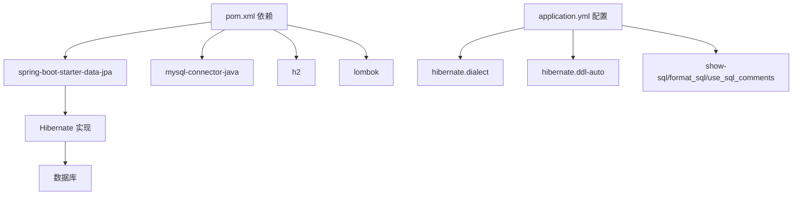

# 数据模型与ORM映射

<cite>
**本文引用的文件列表**
- [User.java](file://src/main/java/com/defi/aave/entity/User.java)
- [UserRepository.java](file://src/main/java/com/defi/aave/repository/UserRepository.java)
- [UserService.java](file://src/main/java/com/defi/aave/service/UserService.java)
- [UserController.java](file://src/main/java/com/defi/aave/controller/UserController.java)
- [application.yml](file://src/main/resources/application.yml)
- [pom.xml](file://pom.xml)
</cite>

## 目录
1. [简介](#简介)
2. [项目结构](#项目结构)
3. [核心组件](#核心组件)
4. [架构总览](#架构总览)
5. [详细组件分析](#详细组件分析)
6. [依赖分析](#依赖分析)
7. [性能考虑](#性能考虑)
8. [故障排查指南](#故障排查指南)
9. [结论](#结论)
10. [附录：数据库表结构定义](#附录数据库表结构定义)

## 简介
本文件围绕用户实体与数据库表之间的映射关系展开，系统梳理：
- 实体类中JPA注解（如@Entity、@Table、@Id、@GeneratedValue等）的具体用法与语义
- 各字段的数据类型、约束（非空、唯一、长度等）及业务含义
- Repository通过继承JpaRepository自动获得的CRUD能力，以及自定义查询方法的命名规范与底层SQL生成机制
- 数据库表结构（主键、索引、外键）
- 实体生命周期回调（如@CreationTimestamp、@UpdateTimestamp）的实现原理与对象状态变化过程
- 性能优化建议（懒加载/急加载、分页查询最佳实践）

## 项目结构
该模块采用经典的三层架构：Controller（接口层）、Service（业务层）、Repository（数据访问层），配合JPA/Hibernate进行ORM映射。

图表来源
- [UserController.java](file://src/main/java/com/defi/aave/controller/UserController.java#L1-L189)
- [UserService.java](file://src/main/java/com/defi/aave/service/UserService.java#L1-L157)
- [UserRepository.java](file://src/main/java/com/defi/aave/repository/UserRepository.java#L1-L55)
- [User.java](file://src/main/java/com/defi/aave/entity/User.java#L1-L54)

章节来源
- [UserController.java](file://src/main/java/com/defi/aave/controller/UserController.java#L1-L189)
- [UserService.java](file://src/main/java/com/defi/aave/service/UserService.java#L1-L157)
- [UserRepository.java](file://src/main/java/com/defi/aave/repository/UserRepository.java#L1-L55)
- [User.java](file://src/main/java/com/defi/aave/entity/User.java#L1-L54)

## 核心组件
- 实体类：User.java 定义了用户实体与其数据库映射关系
- 数据访问接口：UserRepository.java 继承JpaRepository，提供CRUD与自定义查询
- 业务服务：UserService.java 封装事务与业务规则，调用Repository执行数据操作
- 控制器：UserController.java 提供REST接口，支持分页、搜索、计数等

章节来源
- [User.java](file://src/main/java/com/defi/aave/entity/User.java#L1-L54)
- [UserRepository.java](file://src/main/java/com/defi/aave/repository/UserRepository.java#L1-L55)
- [UserService.java](file://src/main/java/com/defi/aave/service/UserService.java#L1-L157)
- [UserController.java](file://src/main/java/com/defi/aave/controller/UserController.java#L1-L189)

## 架构总览
下图展示了从HTTP请求到数据库写入的端到端流程，包含对象状态变化与事务边界。

图表来源
- [UserController.java](file://src/main/java/com/defi/aave/controller/UserController.java#L31-L47)
- [UserService.java](file://src/main/java/com/defi/aave/service/UserService.java#L29-L46)
- [UserRepository.java](file://src/main/java/com/defi/aave/repository/UserRepository.java#L16-L54)
- [User.java](file://src/main/java/com/defi/aave/entity/User.java#L1-L54)

## 详细组件分析

### 实体类与JPA注解详解（User.java）
- 实体声明与表映射
  - @Entity：标记为JPA实体
  - @Table(name = "users")：指定映射的数据库表名为users
- 主键与生成策略
  - @Id：标识主键字段
  - @GeneratedValue(strategy = GenerationType.IDENTITY)：使用数据库自增策略（适用于MySQL、PostgreSQL等）
- 字段映射与约束
  - id：Long，主键，自增
  - username：String，长度上限50，非空且唯一
  - email：String，长度上限100，非空且唯一
  - fullName：String，长度上限100，允许为空
  - walletAddress：String，长度上限42（以太坊地址典型长度），唯一
  - balance：BigDecimal，精度20，标度8，适合存储高精度数值
  - isActive：Boolean，默认true，表示是否启用
  - createdAt：LocalDateTime，不可更新，由@CreationTimestamp自动维护
  - updatedAt：LocalDateTime，可更新，由@UpdateTimestamp自动维护

业务含义与约束说明
- 唯一性：username、email、walletAddress均设置唯一约束，防止重复注册
- 非空性：username、email、createdAt设置为非空，确保关键信息完整性
- 时间戳：通过Hibernate注解自动记录创建与更新时间，无需手动赋值
- 余额：采用BigDecimal并设置精度/标度，避免浮点误差

章节来源
- [User.java](file://src/main/java/com/defi/aave/entity/User.java#L1-L54)

### Repository接口与CRUD能力（UserRepository.java）
- 继承关系
  - UserRepository extends JpaRepository<User, Long>：继承后自动获得基础CRUD、分页、排序等能力
- 自定义查询方法
  - findByUsername(String)：按用户名精确匹配，返回Optional<User>
  - findByEmail(String)：按邮箱精确匹配，返回Optional<User>
  - findByWalletAddress(String)：按钱包地址精确匹配，返回Optional<User>
  - findByIsActiveTrue()：筛选活跃用户
  - existsByUsername(String)/existsByEmail(String)：存在性检查
  - @Query自定义查询：searchUsers(@Param("keyword") String keyword)，基于JPA QL实现模糊匹配用户名或邮箱
- 底层SQL生成机制
  - Spring Data JPA根据方法名解析生成查询（如findByXxx），或通过@Query显式指定JPQL
  - 对于existsXxx方法，底层通常生成COUNT或EXISTS子查询，性能优于全量查询
  - 模糊匹配使用LIKE，注意参数绑定与转义处理

章节来源
- [UserRepository.java](file://src/main/java/com/defi/aave/repository/UserRepository.java#L1-L55)

### 生命周期回调与对象状态变化
- 回调注解
  - @CreationTimestamp：首次持久化时写入createdAt，不可更新
  - @UpdateTimestamp：每次更新时刷新updatedAt
- 对象状态变化过程
  - 新建阶段：对象处于瞬时态（transient），未与持久化上下文关联
  - 保存阶段：调用save()后进入持久化上下文，触发@CreationTimestamp写入
  - 更新阶段：再次save()或修改字段后提交，触发@UpdateTimestamp更新
  - 刷新阶段：flush/commit后，数据库与实体保持一致

图表来源
- [User.java](file://src/main/java/com/defi/aave/entity/User.java#L43-L52)
- [UserService.java](file://src/main/java/com/defi/aave/service/UserService.java#L107-L134)

章节来源
- [User.java](file://src/main/java/com/defi/aave/entity/User.java#L43-L52)
- [UserService.java](file://src/main/java/com/defi/aave/service/UserService.java#L107-L134)

### 分页查询与搜索
- 分页接口
  - Controller接收page、size、sortBy、direction参数，构造PageRequest并调用Service
  - Service调用Repository.findAll(Pageable)返回Page<User>
- 搜索接口
  - Controller支持可选keyword参数；若提供则调用Repository.searchUsers(keyword)
  - Repository通过@Query("... WHERE ... LIKE %:keyword%")实现模糊匹配

图表来源
- [UserController.java](file://src/main/java/com/defi/aave/controller/UserController.java#L66-L108)
- [UserService.java](file://src/main/java/com/defi/aave/service/UserService.java#L80-L102)
- [UserRepository.java](file://src/main/java/com/defi/aave/repository/UserRepository.java#L49-L54)

章节来源
- [UserController.java](file://src/main/java/com/defi/aave/controller/UserController.java#L66-L108)
- [UserService.java](file://src/main/java/com/defi/aave/service/UserService.java#L80-L102)
- [UserRepository.java](file://src/main/java/com/defi/aave/repository/UserRepository.java#L49-L54)

## 依赖分析
- 技术栈
  - Spring Boot Data JPA：提供Repository抽象与自动CRUD
  - Hibernate：JPA实现，负责SQL生成与生命周期回调
  - H2（开发环境）或MySQL（生产可选）：数据库驱动与方言
- 配置要点
  - application.yml中配置数据源、JPA方言、DDL策略、SQL日志格式等
  - pom.xml引入JPA、MySQL/H2驱动、Lombok等

图表来源
- [pom.xml](file://pom.xml#L39-L79)
- [application.yml](file://src/main/resources/application.yml#L18-L41)

章节来源
- [pom.xml](file://pom.xml#L39-L79)
- [application.yml](file://src/main/resources/application.yml#L18-L41)

## 性能考虑
- 查询优化
  - 使用existsXxx方法替代count或全量查询，减少网络与计算开销
  - 对高频查询字段（username、email、walletAddress）建立唯一索引，提升查找效率
- 分页与排序
  - 使用PageRequest指定排序字段与方向，避免一次性加载大量数据
  - 合理设置每页大小，结合前端虚拟滚动或无限滚动
- 懒加载与急加载
  - 默认情况下关联属性为懒加载，避免N+1问题
  - 对必要场景使用@NamedEntityGraph或JOIN FETCH显式急加载，减少额外查询
- SQL日志与监控
  - 开启SQL日志与参数绑定日志，定位慢查询与异常参数
  - 结合数据库慢查询日志与索引使用情况分析

[本节为通用指导，不直接分析具体文件]

## 故障排查指南
- 常见问题
  - 唯一约束冲突：当username/email/walletAddress重复时，持久化会抛出异常
  - 参数绑定错误：@Query中LIKE使用不当可能导致SQL语法错误
  - 分页参数非法：page/size越界或排序字段不存在会导致异常
- 排查步骤
  - 查看SQL日志与参数绑定，确认实际执行的SQL
  - 检查Repository方法签名与命名是否符合Spring Data JPA规范
  - 在Service层增加必要的存在性校验与异常处理

章节来源
- [UserService.java](file://src/main/java/com/defi/aave/service/UserService.java#L29-L46)
- [UserRepository.java](file://src/main/java/com/defi/aave/repository/UserRepository.java#L49-L54)
- [application.yml](file://src/main/resources/application.yml#L43-L52)

## 结论
本项目通过简洁的实体定义与Repository接口，实现了清晰的ORM映射与完善的CRUD能力。结合生命周期回调与分页搜索，满足常见用户管理需求。建议在生产环境中完善索引、开启SQL日志、合理选择加载策略，并对高频查询进行专项优化。

[本节为总结性内容，不直接分析具体文件]

## 附录：数据库表结构定义
以下为users表的完整定义（字段、类型、约束与说明），对应User实体的JPA映射。

- 表名：users
- 字段与约束
  - id：BIGINT，主键，自增
  - username：VARCHAR(50)，非空，唯一
  - email：VARCHAR(100)，非空，唯一
  - full_name：VARCHAR(100)，可空
  - wallet_address：VARCHAR(42)，唯一
  - balance：DECIMAL(20,8)，可空
  - is_active：BOOLEAN，默认true
  - created_at：TIMESTAMP，非空，不可更新
  - updated_at：TIMESTAMP，可空

索引与外键
- 唯一索引：username、email、wallet_address
- 主键：id
- 外键：无（当前实体未定义关联关系）

章节来源
- [User.java](file://src/main/java/com/defi/aave/entity/User.java#L24-L52)
- [application.yml](file://src/main/resources/application.yml#L18-L41)