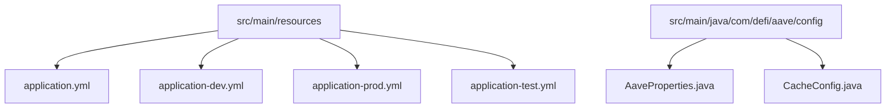

# 配置管理

<cite>
**本文档中引用的文件**  
- [application.yml](file://src/main/resources/application.yml)
- [application-dev.yml](file://src/main/resources/application-dev.yml)
- [application-prod.yml](file://src/main/resources/application-prod.yml)
- [application-test.yml](file://src/main/resources/application-test.yml)
- [pom.xml](file://pom.xml)
- [AaveProperties.java](file://src/main/java/com/defi/aave/config/AaveProperties.java)
- [CacheConfig.java](file://src/main/java/com/defi/aave/config/CacheConfig.java)
</cite>

## 目录
1. [项目结构](#项目结构)
2. [核心配置文件体系](#核心配置文件体系)
3. [Spring Profile 多环境配置机制](#spring-profile-多环境配置机制)
4. [配置项分组结构与实际影响](#配置项分组结构与实际影响)
5. [外部化配置加载顺序与优先级](#外部化配置加载顺序与优先级)
6. [配置加密与敏感信息保护](#配置加密与敏感信息保护)
7. [配置热加载支持](#配置热加载支持)
8. [常见配置错误排查指南](#常见配置错误排查指南)

## 项目结构

本项目采用标准的 Maven 项目结构，配置文件集中存放在 `src/main/resources` 目录下，包括主配置文件和多个环境特定的配置文件。



**图示来源**  
- [application.yml](file://src/main/resources/application.yml)
- [AaveProperties.java](file://src/main/java/com/defi/aave/config/AaveProperties.java)

**本节来源**  
- [application.yml](file://src/main/resources/application.yml)
- [pom.xml](file://pom.xml)

## 核心配置文件体系

项目采用 Spring Boot 的多环境配置体系，以 `application.yml` 为主配置文件，通过 `application-{profile}.yml` 实现环境隔离。

主配置文件 `application.yml` 定义了默认配置和激活的环境：

```yaml
spring:
  profiles:
    active: dev
```

环境特定配置文件包括：
- `application-dev.yml`：开发环境配置
- `application-test.yml`：测试环境配置
- `application-prod.yml`：生产环境配置

配置继承与覆盖规则如下：
- 主配置文件提供基础配置
- 环境配置文件可覆盖主配置中的相同属性
- 未被覆盖的属性保持主配置值
- 环境配置文件中的新增属性会被合并

**本节来源**  
- [application.yml](file://src/main/resources/application.yml)
- [application-dev.yml](file://src/main/resources/application-dev.yml)
- [application-prod.yml](file://src/main/resources/application-prod.yml)
- [application-test.yml](file://src/main/resources/application-test.yml)

## Spring Profile 多环境配置机制

Spring Profile 机制通过 `spring.profiles.active` 属性实现多环境配置切换。

### 环境配置对比

| 配置项 | 开发环境 (dev) | 生产环境 (prod) | 测试环境 (test) |
|--------|----------------|-----------------|-----------------|
| 数据库 | H2 内存数据库 | MySQL 数据库 | H2 内存数据库 |
| 数据库URL | jdbc:h2:mem:devdb | jdbc:mysql://localhost:3306/defi_aave | jdbc:h2:mem:testdb |
| JPA DDL | create-drop | validate | create-drop |
| 日志级别 | DEBUG | INFO | INFO |
| H2 控制台 | 启用 | 禁用 | 禁用 |
| 服务端口 | 8080 | 8080 | 8080 |

### 环境切换方式

1. **配置文件指定**：在 `application.yml` 中设置 `spring.profiles.active=dev`
2. **命令行参数**：`java -jar app.jar --spring.profiles.active=prod`
3. **环境变量**：`SPRING_PROFILES_ACTIVE=prod`
4. **JVM 参数**：`-Dspring.profiles.active=prod`

**本节来源**  
- [application.yml](file://src/main/resources/application.yml)
- [application-dev.yml](file://src/main/resources/application-dev.yml)
- [application-prod.yml](file://src/main/resources/application-prod.yml)
- [application-test.yml](file://src/main/resources/application-test.yml)
- [README.md](file://README.md#L113-L124)

## 配置项分组结构与实际影响

配置文件按功能分组，每组配置对应用行为产生特定影响。

### server 配置组

```yaml
server:
  port: 8080
  servlet:
    context-path: /api
```

- **port**: 服务监听端口，影响应用访问地址
- **context-path**: 应用上下文路径，所有 API 前缀

### spring 配置组

包含数据源、JPA、事务等核心配置：

- **datasource**: 数据库连接配置，包括 URL、用户名、密码
- **jpa**: JPA/Hibernate 配置，影响实体映射和 SQL 生成
- **h2.console**: H2 数据库控制台访问配置

### logging 配置组

```yaml
logging:
  level:
    root: INFO
    com.defi.aave: DEBUG
    org.hibernate.SQL: DEBUG
  pattern:
    console: "%d{yyyy-MM-dd HH:mm:ss} - %msg%n"
```

- 控制不同包的日志输出级别
- 定义日志输出格式
- 影响调试信息的详细程度

### aave 自定义配置组

```yaml
aave:
  etherscan:
    api-key: ${ETHERSCAN_API_KEY:YOUR_API_KEY_HERE}
  token:
    contract-address: 0x7Fc66500c84A76Ad7e9c93437bFc5Ac33E2DDaE9
    min-holding: 3000
  cache:
    price-ttl: 300
```

- **etherscan.api-key**: 使用环境变量注入，提供默认值
- **token.contract-address**: AAVE 代币合约地址
- **cache.price-ttl**: 价格缓存过期时间（秒）

**本节来源**  
- [application.yml](file://src/main/resources/application.yml)
- [AaveProperties.java](file://src/main/java/com/defi/aave/config/AaveProperties.java)

## 外部化配置加载顺序与优先级

Spring Boot 遵循特定的配置加载顺序，优先级从高到低如下：

1. 命令行参数
2. SPRING_APPLICATION_JSON 中的属性
3. ServletConfig 初始化参数
4. ServletContext 初始化参数
5. JNDI 属性
6. Java System 属性
7. OS 环境变量
8. 随机生成的值 (random.*)
9. jar 包外的 profile-specific 配置文件
10. jar 包内的 profile-specific 配置文件
11. jar 包外的 application.yml
12. jar 包内的 application.yml
13. @Configuration 类上的 @PropertySource
14. 默认属性

### 配置覆盖示例

```bash
java -jar app.jar \
  --spring.profiles.active=prod \
  --spring.datasource.password=mypassword \
  --aave.cache.price-ttl=600
```

命令行参数会覆盖配置文件中的对应值。

**本节来源**  
- [application.yml](file://src/main/resources/application.yml)
- [pom.xml](file://pom.xml)

## 配置加密与敏感信息保护

项目采用多种机制保护敏感配置信息：

### 环境变量注入

```yaml
spring:
  datasource:
    password: ${DB_PASSWORD:your_password}
aave:
  etherscan:
    api-key: ${ETHERSCAN_API_KEY:YOUR_API_KEY_HERE}
```

- 敏感信息通过环境变量注入
- 提供默认值用于开发环境
- 生产环境必须通过环境变量提供真实值

### 最佳实践建议

1. **生产环境**：使用环境变量或密钥管理服务
2. **配置文件**：避免在版本控制中存储敏感信息
3. **默认值**：为开发环境提供安全的默认值
4. **文档说明**：在 README 中明确需要配置的环境变量

```bash
# 生产部署示例
java -jar defi-aave-1.0.0.jar \
  --spring.profiles.active=prod \
  --spring.datasource.password=${DB_PASSWORD}
```

**本节来源**  
- [application-prod.yml](file://src/main/resources/application-prod.yml)
- [README.md](file://README.md#L300-L310)

## 配置热加载支持

项目通过以下机制支持配置变更的热加载：

### Spring Boot DevTools

```xml
<dependency>
    <groupId>org.springframework.boot</groupId>
    <artifactId>spring-boot-devtools</artifactId>
    <scope>runtime</scope>
    <optional>true</optional>
</dependency>
```

- 开发环境启用自动重启
- 静态资源修改无需重启
- 配置文件修改触发应用重启

### 配置属性刷新

对于 `@ConfigurationProperties` 注解的类，可通过 `@RefreshScope` 实现热刷新：

```java
@Configuration
@ConfigurationProperties(prefix = "aave")
@Data
public class AaveProperties {
    // 配置属性
}
```

结合 Spring Cloud Config 可实现运行时配置更新。

**本节来源**  
- [pom.xml](file://pom.xml#L67-L73)
- [AaveProperties.java](file://src/main/java/com/defi/aave/config/AaveProperties.java)
- [CacheConfig.java](file://src/main/java/com/defi/aave/config/CacheConfig.java)

## 常见配置错误排查指南

### 1. 环境未正确激活

**症状**：应用使用了错误的数据库配置

**排查步骤**：
- 检查 `application.yml` 中的 `spring.profiles.active`
- 确认命令行参数是否覆盖了配置
- 查看启动日志中的 "The following profiles are active" 信息

### 2. 数据库连接失败

**症状**：应用启动时抛出数据库连接异常

**排查步骤**：
- 确认数据库服务是否运行
- 检查数据库 URL、用户名、密码是否正确
- 对于生产环境，确认 `DB_PASSWORD` 环境变量已设置
- 检查数据库驱动依赖是否正确

### 3. 配置属性未生效

**症状**：自定义配置属性值未被正确注入

**排查步骤**：
- 确认 `@ConfigurationProperties` 类已正确注解
- 检查属性前缀是否匹配
- 确认配置文件中的属性名拼写正确
- 查看启动日志是否有配置绑定警告

### 4. 日志级别不正确

**症状**：期望的日志信息未输出

**排查步骤**：
- 检查 `logging.level` 配置是否正确
- 确认当前激活的 profile
- 检查是否有更高优先级的配置覆盖了日志级别

### 5. H2 控制台无法访问

**症状**：`/h2-console` 路径无法访问

**排查步骤**：
- 确认 `spring.h2.console.enabled` 为 true
- 检查 `spring.h2.console.path` 配置
- 确认当前环境允许 H2 控制台访问
- 检查是否有安全配置阻止了访问

**本节来源**  
- [application-dev.yml](file://src/main/resources/application-dev.yml)
- [application-prod.yml](file://src/main/resources/application-prod.yml)
- [README.md](file://README.md#L104-L105)