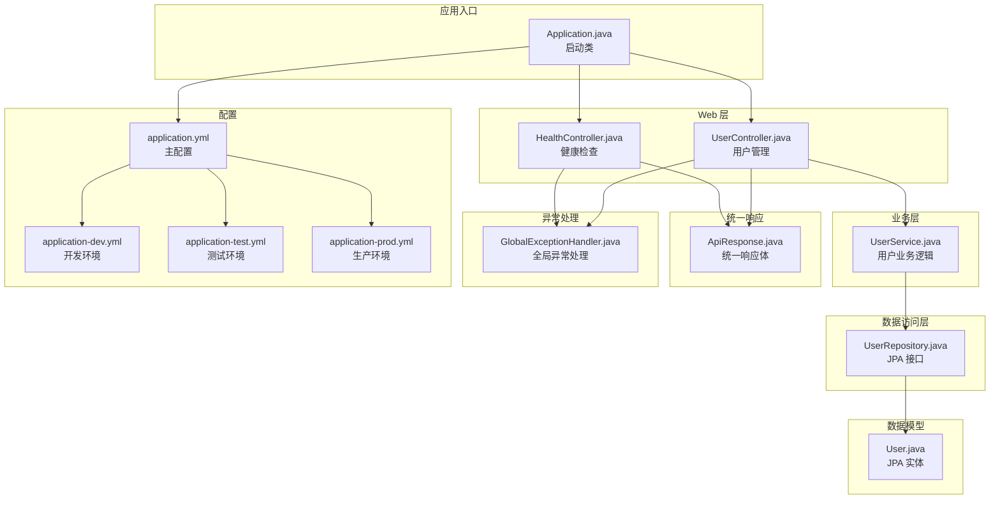
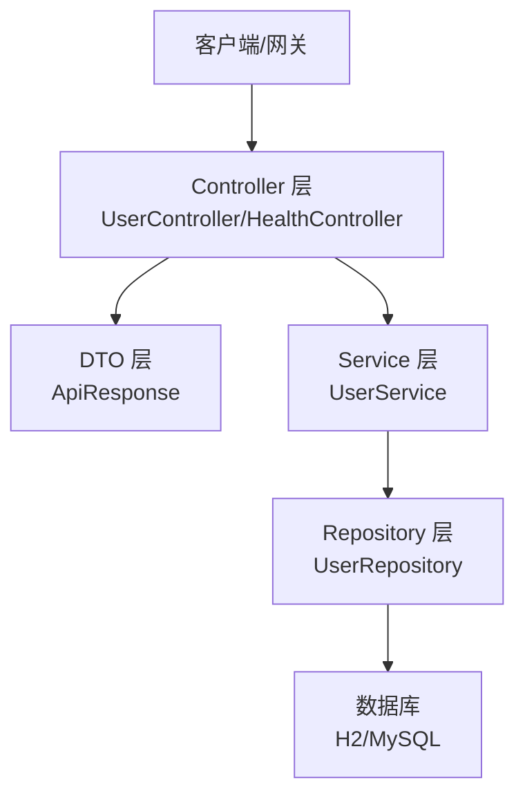
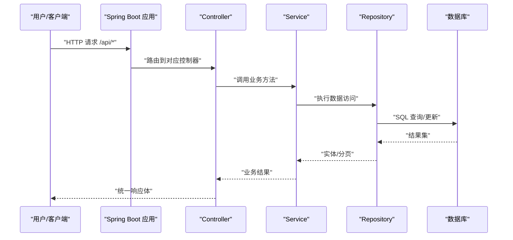
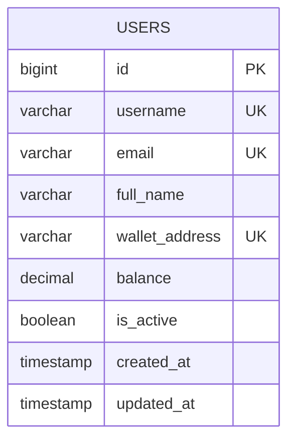
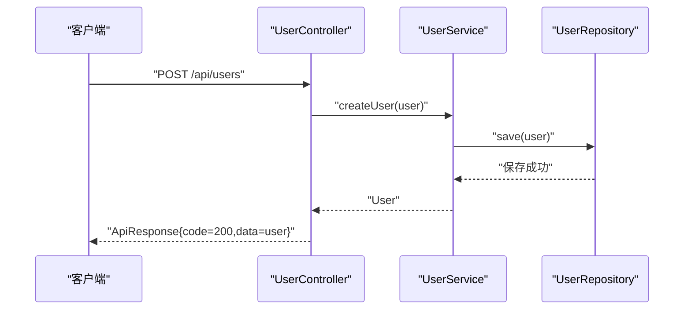
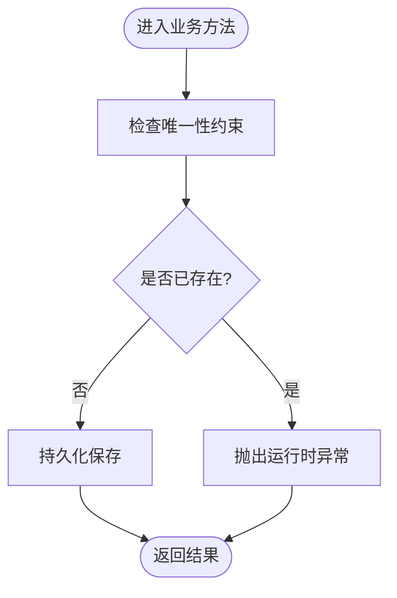
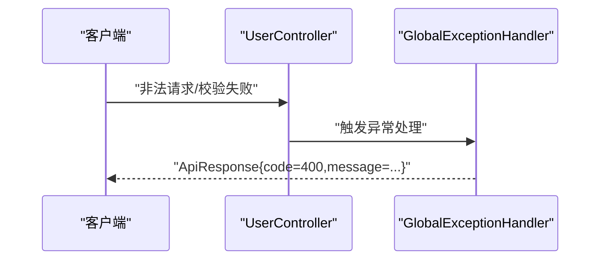
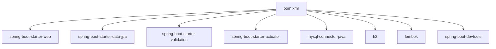

# 项目概述

<cite>
**本文引用的文件列表**
- [Application.java](file://src/main/java/com/defi/aave/Application.java)
- [UserController.java](file://src/main/java/com/defi/aave/controller/UserController.java)
- [UserService.java](file://src/main/java/com/defi/aave/service/UserService.java)
- [UserRepository.java](file://src/main/java/com/defi/aave/repository/UserRepository.java)
- [User.java](file://src/main/java/com/defi/aave/entity/User.java)
- [ApiResponse.java](file://src/main/java/com/defi/aave/dto/ApiResponse.java)
- [GlobalExceptionHandler.java](file://src/main/java/com/defi/aave/exception/GlobalExceptionHandler.java)
- [HealthController.java](file://src/main/java/com/defi/aave/controller/HealthController.java)
- [application.yml](file://src/main/resources/application.yml)
- [application-dev.yml](file://src/main/resources/application-dev.yml)
- [application-test.yml](file://src/main/resources/application-test.yml)
- [application-prod.yml](file://src/main/resources/application-prod.yml)
- [pom.xml](file://pom.xml)
- [README.md](file://README.md)
</cite>

## 目录
1. [引言](#引言)
2. [项目结构](#项目结构)
3. [核心组件](#核心组件)
4. [架构总览](#架构总览)
5. [详细组件分析](#详细组件分析)
6. [依赖分析](#依赖分析)
7. [性能考虑](#性能考虑)
8. [故障排查指南](#故障排查指南)
9. [结论](#结论)
10. [附录](#附录)

## 引言
本项目是一个基于 Spring Boot 的 DeFi 平台用户管理微服务，采用经典的三层架构（Controller-Service-Repository），通过 RESTful API 提供用户生命周期管理能力，并与数据库进行交互。项目遵循最小可行原则，聚焦于用户实体的增删改查、分页查询、活跃用户筛选、统计计数等核心功能，同时提供统一的响应体结构、全局异常处理与多环境配置。

在 DeFi 生态中，用户管理是金融基础设施的重要组成部分：账户、钱包地址、余额等字段与链上资产密切相关。该服务可作为更复杂 DeFi 应用的用户中心，支撑借贷、交易、质押等上层业务的用户数据需求。

## 项目结构
项目采用标准 Maven 结构，按功能域划分包：
- controller：对外暴露 REST API，负责请求路由与响应封装
- service：业务逻辑层，协调数据访问与事务控制
- repository：数据访问层，基于 Spring Data JPA 提供数据操作
- entity：JPA 实体定义，映射 users 表
- dto：统一响应体模型
- exception：全局异常处理
- resources：多环境配置文件与 Actuator 监控配置

图表来源
- [Application.java](file://src/main/java/com/defi/aave/Application.java#L1-L20)
- [HealthController.java](file://src/main/java/com/defi/aave/controller/HealthController.java#L1-L47)
- [UserController.java](file://src/main/java/com/defi/aave/controller/UserController.java#L1-L190)
- [UserService.java](file://src/main/java/com/defi/aave/service/UserService.java#L1-L158)
- [UserRepository.java](file://src/main/java/com/defi/aave/repository/UserRepository.java#L1-L55)
- [User.java](file://src/main/java/com/defi/aave/entity/User.java#L1-L54)
- [ApiResponse.java](file://src/main/java/com/defi/aave/dto/ApiResponse.java#L1-L77)
- [GlobalExceptionHandler.java](file://src/main/java/com/defi/aave/exception/GlobalExceptionHandler.java#L1-L98)
- [application.yml](file://src/main/resources/application.yml#L1-L63)
- [application-dev.yml](file://src/main/resources/application-dev.yml#L1-L27)
- [application-test.yml](file://src/main/resources/application-test.yml#L1-L21)
- [application-prod.yml](file://src/main/resources/application-prod.yml#L1-L34)

章节来源
- [README.md](file://README.md#L33-L58)
- [pom.xml](file://pom.xml#L31-L93)

## 核心组件
- 启动类 Application：应用入口，使用 Spring Boot 自动装配启动内嵌 Web 服务器。
- 控制器 UserController：提供用户管理相关 REST API，统一返回 ApiResponse。
- 业务服务 UserService：实现用户业务规则（去重校验、更新字段选择性更新、事务边界），调用仓库层完成持久化。
- 数据仓库 UserRepository：继承 JpaRepository，提供常用查询方法与自定义查询。
- 实体 User：JPA 实体，映射 users 表，包含用户名、邮箱、钱包地址、余额、活跃状态及时间戳。
- 统一响应 ApiResponse：标准化响应结构，便于前端消费与调试。
- 全局异常处理 GlobalExceptionHandler：集中处理校验异常、约束冲突、运行时异常等，保证一致的错误响应。
- 健康检查 HealthController：提供应用健康状态与欢迎信息，便于运维监控。
- 多环境配置：application.yml 为主配置，application-{dev,test,prod}.yml 覆盖不同环境的数据源、JPA、日志与 Actuator。

章节来源
- [Application.java](file://src/main/java/com/defi/aave/Application.java#L1-L20)
- [UserController.java](file://src/main/java/com/defi/aave/controller/UserController.java#L1-L190)
- [UserService.java](file://src/main/java/com/defi/aave/service/UserService.java#L1-L158)
- [UserRepository.java](file://src/main/java/com/defi/aave/repository/UserRepository.java#L1-L55)
- [User.java](file://src/main/java/com/defi/aave/entity/User.java#L1-L54)
- [ApiResponse.java](file://src/main/java/com/defi/aave/dto/ApiResponse.java#L1-L77)
- [GlobalExceptionHandler.java](file://src/main/java/com/defi/aave/exception/GlobalExceptionHandler.java#L1-L98)
- [HealthController.java](file://src/main/java/com/defi/aave/controller/HealthController.java#L1-L47)
- [application.yml](file://src/main/resources/application.yml#L1-L63)
- [application-dev.yml](file://src/main/resources/application-dev.yml#L1-L27)
- [application-test.yml](file://src/main/resources/application-test.yml#L1-L21)
- [application-prod.yml](file://src/main/resources/application-prod.yml#L1-L34)

## 架构总览
系统采用分层架构，职责清晰：
- 表现层：控制器接收请求，调用服务层，返回统一响应体。
- 业务层：封装业务规则与事务边界，协调数据访问。
- 数据访问层：基于 Spring Data JPA，提供类型安全的查询与分页能力。
- 数据层：H2（开发/测试）与 MySQL（生产）双环境支持，DDL 策略随环境变化。

图表来源
- [UserController.java](file://src/main/java/com/defi/aave/controller/UserController.java#L1-L190)
- [HealthController.java](file://src/main/java/com/defi/aave/controller/HealthController.java#L1-L47)
- [UserService.java](file://src/main/java/com/defi/aave/service/UserService.java#L1-L158)
- [UserRepository.java](file://src/main/java/com/defi/aave/repository/UserRepository.java#L1-L55)
- [ApiResponse.java](file://src/main/java/com/defi/aave/dto/ApiResponse.java#L1-L77)

## 详细组件分析

### 启动流程与自动配置
- 启动类 Application 使用注解标记应用入口，Spring Boot 自动装配 Web 与 JPA 环境，加载配置文件并启动内嵌服务器。
- application.yml 指定端口、上下文路径、活动 profile、数据源与 JPA 设置；多环境 yml 文件覆盖对应配置。
- Actuator 默认开启 health、info、metrics 端点，便于健康检查与指标采集。

图表来源
- [Application.java](file://src/main/java/com/defi/aave/Application.java#L1-L20)
- [UserController.java](file://src/main/java/com/defi/aave/controller/UserController.java#L1-L190)
- [UserService.java](file://src/main/java/com/defi/aave/service/UserService.java#L1-L158)
- [UserRepository.java](file://src/main/java/com/defi/aave/repository/UserRepository.java#L1-L55)
- [application.yml](file://src/main/resources/application.yml#L1-L63)

章节来源
- [Application.java](file://src/main/java/com/defi/aave/Application.java#L1-L20)
- [application.yml](file://src/main/resources/application.yml#L1-L63)

### 关键注解与职责
- @SpringBootApplication：组合注解，启用自动配置、组件扫描与条件化配置，简化启动流程。
- @RestController：声明控制器并返回 JSON，结合 @RequestMapping 定义资源路径。
- @Service：声明业务组件，交由 IoC 容器管理。
- @Repository：声明数据访问组件，Spring Data JPA 将其识别为仓库接口。
- @Entity/@Table：声明 JPA 实体及其表映射。
- @RequiredArgsConstructor（Lombok）：生成基于构造函数的注入，减少样板代码。
- @Slf4j（Lombok）：生成日志门面，便于统一记录。
- @Transactional：声明事务边界，确保业务一致性。

章节来源
- [Application.java](file://src/main/java/com/defi/aave/Application.java#L1-L20)
- [UserController.java](file://src/main/java/com/defi/aave/controller/UserController.java#L1-L190)
- [UserService.java](file://src/main/java/com/defi/aave/service/UserService.java#L1-L158)
- [UserRepository.java](file://src/main/java/com/defi/aave/repository/UserRepository.java#L1-L55)
- [User.java](file://src/main/java/com/defi/aave/entity/User.java#L1-L54)
- [ApiResponse.java](file://src/main/java/com/defi/aave/dto/ApiResponse.java#L1-L77)
- [GlobalExceptionHandler.java](file://src/main/java/com/defi/aave/exception/GlobalExceptionHandler.java#L1-L98)

### 数据模型与表结构
- 实体 User 映射 users 表，包含唯一约束字段（username、email、wallet_address）、数值精度字段（balance）、布尔字段（is_active）与时间戳字段（created_at、updated_at）。
- JPA 配置在 application.yml 中设置方言、DDL 策略、SQL 输出与格式化等。

图表来源
- [User.java](file://src/main/java/com/defi/aave/entity/User.java#L1-L54)
- [application.yml](file://src/main/resources/application.yml#L1-L63)

章节来源
- [User.java](file://src/main/java/com/defi/aave/entity/User.java#L1-L54)
- [README.md](file://README.md#L256-L271)

### 控制器与 API 设计
- UserController 提供用户管理的完整 REST API：创建、查询、分页、活跃用户筛选、更新、删除、计数。
- 统一使用 ApiResponse 包裹响应，便于前后端约定与调试。
- 对分页参数进行校验与排序方向解析，确保健壮性。

图表来源
- [UserController.java](file://src/main/java/com/defi/aave/controller/UserController.java#L1-L190)
- [UserService.java](file://src/main/java/com/defi/aave/service/UserService.java#L1-L158)
- [UserRepository.java](file://src/main/java/com/defi/aave/repository/UserRepository.java#L1-L55)
- [ApiResponse.java](file://src/main/java/com/defi/aave/dto/ApiResponse.java#L1-L77)

章节来源
- [UserController.java](file://src/main/java/com/defi/aave/controller/UserController.java#L1-L190)
- [README.md](file://README.md#L128-L145)

### 业务逻辑与事务控制
- UserService 在创建与更新时进行唯一性校验，避免重复用户名与邮箱。
- 更新采用选择性更新策略，仅对非空字段赋值，降低写放大。
- 所有写操作均在事务中执行，保证一致性。

图表来源
- [UserService.java](file://src/main/java/com/defi/aave/service/UserService.java#L1-L158)
- [UserRepository.java](file://src/main/java/com/defi/aave/repository/UserRepository.java#L1-L55)

章节来源
- [UserService.java](file://src/main/java/com/defi/aave/service/UserService.java#L1-L158)

### 数据访问层与查询策略
- UserRepository 继承 JpaRepository，天然具备 CRUD 与分页能力。
- 提供基于属性的查询方法（findByXxx），以及自定义 JPQL 查询（searchUsers）。
- 支持根据钱包地址、活跃状态等条件检索。

章节来源
- [UserRepository.java](file://src/main/java/com/defi/aave/repository/UserRepository.java#L1-L55)

### 统一响应与异常处理
- ApiResponse 提供成功/错误/客户端错误等静态工厂方法，统一返回结构。
- GlobalExceptionHandler 集中处理校验异常、约束冲突、非法参数与通用异常，返回标准化错误响应。

图表来源
- [GlobalExceptionHandler.java](file://src/main/java/com/defi/aave/exception/GlobalExceptionHandler.java#L1-L98)
- [ApiResponse.java](file://src/main/java/com/defi/aave/dto/ApiResponse.java#L1-L77)

章节来源
- [ApiResponse.java](file://src/main/java/com/defi/aave/dto/ApiResponse.java#L1-L77)
- [GlobalExceptionHandler.java](file://src/main/java/com/defi/aave/exception/GlobalExceptionHandler.java#L1-L98)

### 健康检查与监控
- HealthController 提供健康状态与欢迎信息，便于快速验证服务可用性。
- Actuator 暴露健康、信息与指标端点，结合 application.yml 配置暴露范围与细节策略。

章节来源
- [HealthController.java](file://src/main/java/com/defi/aave/controller/HealthController.java#L1-L47)
- [application.yml](file://src/main/resources/application.yml#L55-L63)

## 依赖分析
- 核心依赖：spring-boot-starter-web、spring-boot-starter-data-jpa、spring-boot-starter-validation、spring-boot-starter-actuator。
- 数据库驱动：H2（开发/测试）、MySQL（生产）。
- 工具：Lombok（简化实体与日志）、DevTools（开发热部署）。
- 构建插件：spring-boot-maven-plugin，排除 Lombok 编译期依赖。

图表来源
- [pom.xml](file://pom.xml#L31-L113)

章节来源
- [pom.xml](file://pom.xml#L31-L113)

## 性能考虑
- 数据库层面：生产环境使用 MySQL 并配置连接池参数；DDL 策略在生产为 validate，避免运行时变更表结构带来的风险。
- SQL 输出：开发/测试环境开启 show-sql 与格式化，便于调试；生产关闭 show-sql，降低日志开销。
- 分页查询：控制器与服务层均支持分页，建议在高并发场景下限制最大页大小与排序字段，防止资源滥用。
- 事务边界：写操作使用 @Transactional，避免长事务占用锁资源；批量操作建议拆分为小批次提交。
- 日志级别：生产环境降低 SQL 日志级别，避免高频写入影响性能。

章节来源
- [application.yml](file://src/main/resources/application.yml#L1-L63)
- [application-prod.yml](file://src/main/resources/application-prod.yml#L1-L34)
- [application-dev.yml](file://src/main/resources/application-dev.yml#L1-L27)
- [application-test.yml](file://src/main/resources/application-test.yml#L1-L21)

## 故障排查指南
- 启动失败：检查 application.yml 中 server.port、context-path、profiles.active 是否正确；确认数据库驱动与 URL 配置。
- 数据库连接问题：核对 datasource.url、driver-class-name、username、password；生产环境需设置 DB_PASSWORD 环境变量。
- API 返回错误：查看 GlobalExceptionHandler 的错误码与消息；结合日志定位具体异常类型。
- H2 控制台：开发环境可通过 /h2-console 访问，验证表结构与数据。
- Actuator：访问 /actuator/health 查看应用健康状态，/actuator/metrics 获取指标。

章节来源
- [application.yml](file://src/main/resources/application.yml#L1-L63)
- [application-dev.yml](file://src/main/resources/application-dev.yml#L1-L27)
- [application-prod.yml](file://src/main/resources/application-prod.yml#L1-L34)
- [GlobalExceptionHandler.java](file://src/main/java/com/defi/aave/exception/GlobalExceptionHandler.java#L1-L98)

## 结论
本项目以 Spring Boot 为基础，采用清晰的分层架构与统一响应模型，实现了用户管理的完整 CRUD 能力，并通过多环境配置与 Actuator 监控保障了开发与生产的可维护性。在 DeFi 生态中，该服务可作为用户中心的基础模块，支撑后续借贷、交易等上层业务的数据需求。未来可在现有基础上引入缓存、异步任务、鉴权与审计日志等能力，进一步提升性能与安全性。

## 附录
- API 端点概览（来自 README）
  - 健康检查：GET /api/health、GET /api/health/welcome
  - 用户管理：POST /api/users、GET /api/users、GET /api/users/{id}、GET /api/users/active、GET /api/users/page、GET /api/users/count、PUT /api/users/{id}、DELETE /api/users/{id}

章节来源
- [README.md](file://README.md#L128-L145)